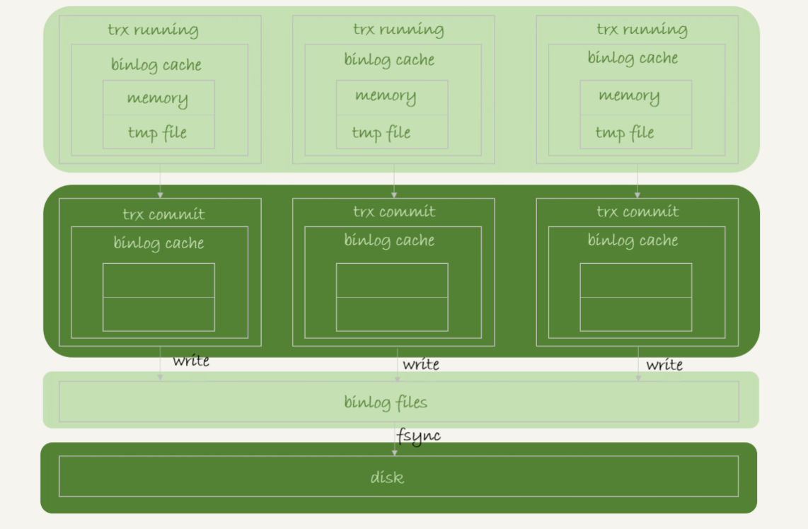
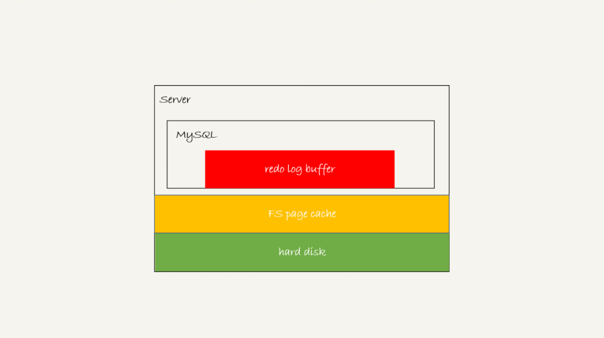
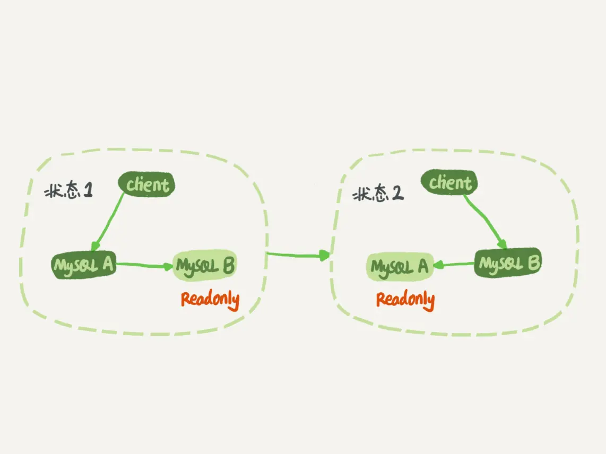
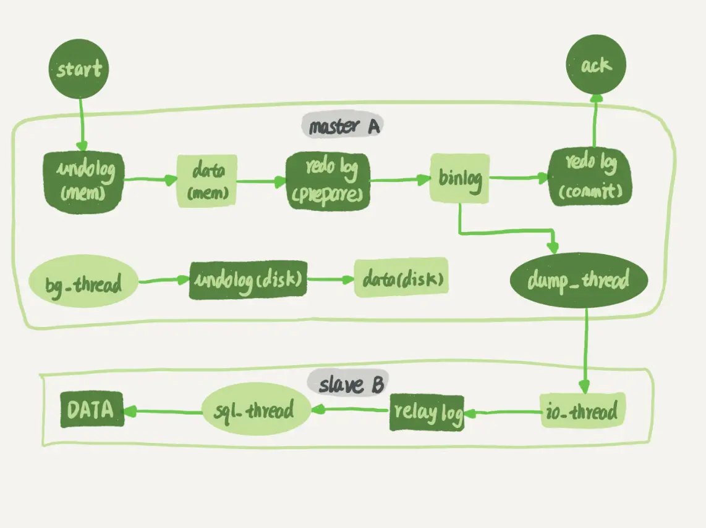

# 日志简介
① 事务的隔离性由```锁机制```实现  
② ```redo log```提供再写入操作，恢复提交事务修改的页操作，用来保证事务的持久性  
③ ```undo log```回滚行记录到某个特定版本，用来保证事务的原子性、一致性

# 慢查询日志

# 通用查询日志
通用查询日志用来记录用户的所有操作，包括启动和关闭MySQL服务、所有用户的连接开始时间和截止时间、发给MySQL数据库服务器的所有SQL指令等。当我们的数据发生异常时，查看通用查询日志，
还原操作时间的具体场景，可以帮助我们准确定位问题  

如果希望备份旧的通用查询日志，就必须将旧的日志文件复制出来或者改名，然后执行下面的mysqladmin命令
```sql
mysqladmin -uroot -p flush-logs;
```

# 错误日志
记录MySQL服务的启动、运行或停止MySQL服务出现的问题，方便我们了解服务的状态，从而对服务器进行维护  
```
[mysqld]
log-error=[paht]    # path为日志文件所在的目录路径，filename为日志文件名
```

# 二进制日志(bin log)
记录所有更改数据的语句，可以用于主从服务器之间的数据同步，以及服务器遇到故障时数据的无损失恢复  

### bin log的格式
Row：不记录Sql语句上下文相关信息，仅保存哪条记录被修改  
Statement：每一条会修改数据的sql都会记录在binlog中  
Mixed：上面两种格式的结合

### 

# 中继日志
中继日志只在主从服务器架构的从服务器上存在  

# 数据定义语句日志

# Redo Log
好处：redo日志降低刷盘频率，并且占用空间非常小  
特点：redo日志是顺序写入磁盘的，并且在事务执行过程中，redo log是不断记录的，而binlog则是在事务提交的时候才会一次性写入  
数据目录下ib_logfile0和ib_logfile1即是redo 日志

### redo log buffer
查看redo log buffer的大小，默认16m。最大值是4096m，最小值是1m
```show variables like '%innodb_log_buffer_size%';```

### redo log的整体流程


### innodb_flush_log_at_trx_commit参数详解

### redo log的buffer和file的写入策略

# Undo log
redo log是事务持久性的保证，undo log是事务原子性的保证。在事务中更新数据的前置操作其实是要先写入一个undo log  
注意：undo log是逻辑日志，将数据库逻辑的恢复到原来的样子，所有修改都被逻辑的取消了，但是数据结构和页本身在回滚之后可能大不相同（例如新开的页不能删除）  

## Redo log 和 Undo log的详细生成过程


# MySQL写入binlog和redo log的流程
## binlog的写入机制
事务执行过程中，先把日志写到binlog cache，事务提交的时候，再把binlog cache写到binlog文件中，每个线程有自己的binlog cache，但是共用同一份binlog文件  
系统给binlog cache分配一片内存，每个线程一个，参数binlog_cache_size用于控制单个线程内binlog cache所占内存的大小。如果超过了这个参数的规定，就要暂存到磁盘  

图解：  
write：指的就是把日志写到文件系统的page cache，并没有把数据持久化到磁盘，所以速度比较快。  
fsync：才是将数据持久化到磁盘的操作，一般情况下，我们认为fsync才占磁盘的IOPS。  
write 和fsync的时机，是由参数sync_binlog控制的：  
①sync_binlog=0的时候，表示每次提交事务都只write，不fsync；  
②sync_binlog=1的时候，表示每次提交事务都会执行fsync；  
③sync_binlog=N(N>1)的时候，表示每次提交事务都write，但累积N个事务后才fsync。  
因此，在出现IO瓶颈的场景里，将sync_binlog设置成一个比较大的值，可以提升性能。在实际的业务场景中，考虑到丢失日志量的可控性，
一般不建议将这个参数设成0，比较常见的是将其设置为100~1000中的某个数值。但是，将sync_binlog设置为N，对应的风险是：如果主机发生异常重启，
会丢失最近N个事务的binlog日志。

## binlog的三种格式
①statement：binlog里面记录的就是SQL语句的原文
②row：binlog里面记录了真实删除行的主键id  
③mixed：
statement格式的binlog可能会导致主备不一致，而row格式缺陷是占空间，而且写binlog也会耗费IO资源，影响执行速度  
MySQL自己会判断这条SQL语句是否可能引起主备不一致，如果有可能，就用row格式，否则就用statement格式

## binlog日志详解
①binlog文件会随服务的启动创建一个新文件
②通过flush logs 可以手动刷新日志，生成一个新的binlog文件
③通过show master status 可以查看binlog的状态
④通过reset master 可以清空binlog日志文件
⑤通过mysql binlog 工具可以查看binlog日志的内容
⑥通过执行dml mysql会自动记录binlog
⑦按事件查看日志内容 ```show binlog events in 'mysql-bin.000001'\G```

## redo log的写入机制
事务在执行过程中，生成的redo log是要先写到redo log buffer的，里面的内容不需要每次生成后持久化到磁盘  

redo log存在三种状态  
①存在redo log buffer中，物理上是在MySQL进程内存中，就是图中的红色部分；  
②写到磁盘(write)，但是没有持久化（fsync)，物理上是在文件系统的page cache里面，也就是图中的黄色部分；  
③持久化到磁盘，对应的是hard disk，也就是图中的绿色部分。  
redo log写到redo log buffer是很快的，write到page cache也差不多，但是持久化到磁盘的速度就慢多了  
为了控制redo log的写入策略，InnoDB提供了innodb_flush_log_at_trx_commit参数，它有三种可能取值：  
①设置为0的时候，表示每次事务提交时都只是把redo log留在redo log buffer中;  
②设置为1的时候，表示每次事务提交时都将redo log直接持久化到磁盘；  
③设置为2的时候，表示每次事务提交时都只是把redo log写到page cache。  
有三种场景下会让一个没有提交的事务的redo log写入到磁盘中  
①InnoDB有一个后台线程，每隔1秒，就会把redo log buffer中的日志，调用write写到文件系统的page cache，然后调用fsync持久化到磁盘  
事务执行中间过程的redo log也是直接写在redo log buffer中的，这些redo log也会被后台线程一起持久化到磁盘。也就是说，一个没有提交的事务的redo log，也是可能已经持久化到磁盘的。
②redo log buffer占用的空间即将达到 innodb_log_buffer_size一半的时候，后台线程会主动写盘。  
③并行的事务提交的时候，顺带将这个事务的redo log buffer持久化到磁盘。

# MySQL主备的基本原理

建议把备库设置成只读模式。防止切换过程中出现双写，造成主备不一致  
readonly设置对超级(super)权限用户是无效的，而用于同步更新的线程，就拥有超级权限  

大致流程是：主库接收到客户端的更新请求后，执行内部事务的更新逻辑，同时写binlog。备库跟主库之间维持一个长连接，主库内部有一个线程，专门用于服务备库
的这个长连接。  
①在备库B上通过change master命令，设置主库A的IP、端口、用户名、密码，以及要从哪个位置开始请求binlog，这个位置包含文件名和日志偏移量。  
②在备库B上执行start slave命令，这时候备库会启动两个线程，就是图中的io_thread和sql_thread。其中io_thread负责与主库建立连接。  
③主库A校验完用户名、密码后，开始按照备库B传过来的位置，从本地读取binlog，发给B。  
④备库B拿到binlog后，写到本地文件，称为中转日志（relay log）。  
⑤sql_thread读取中转日志，解析出日志里的命令，并执行。

# 刷脏页
1 触发刷脏页的场景  
①InnoDB的redo log写满了，系统会停止所有更新操作，把checkpoint往前推进，redo log留出空间可以继续写。  
②系统内存不足，当需要新的内存页，而内存不够用的时候，就要淘汰一些数据页，空出内存给别的数据页使用。如果淘汰的是“脏页”，就要先将脏页写到磁盘。  
③MySQL认为系统“空闲”的时候  
④MySQL正常关闭的情况  

2 刷脏页时，可能会影响性能的场景  
① 一个查询要淘汰的脏页个数太多，会导致查询的响应时间明显变长。  
② 日志写满，更新全部堵住，写性能跌为0，这种情况对敏感业务来说，是不能接受的。

3 控制脏页比例的机制  


