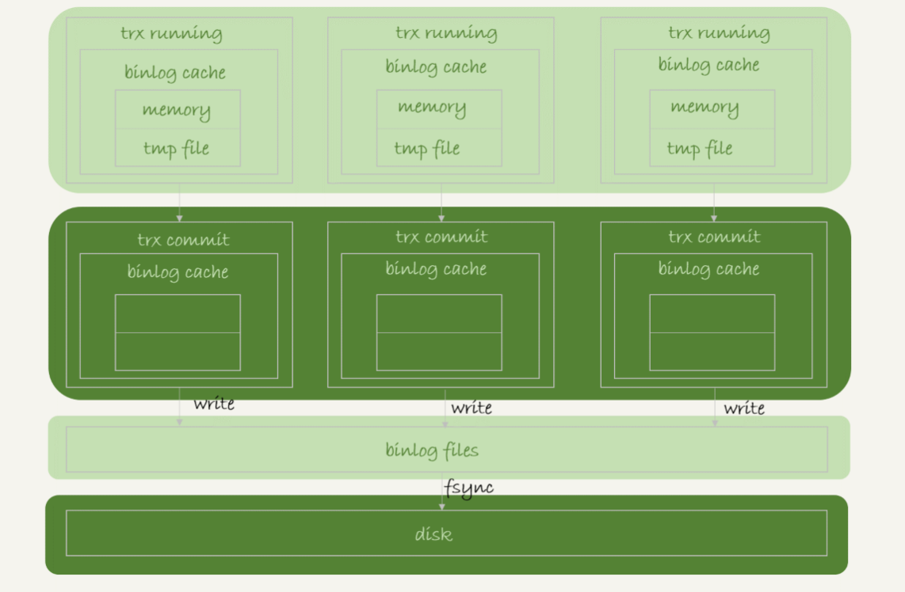
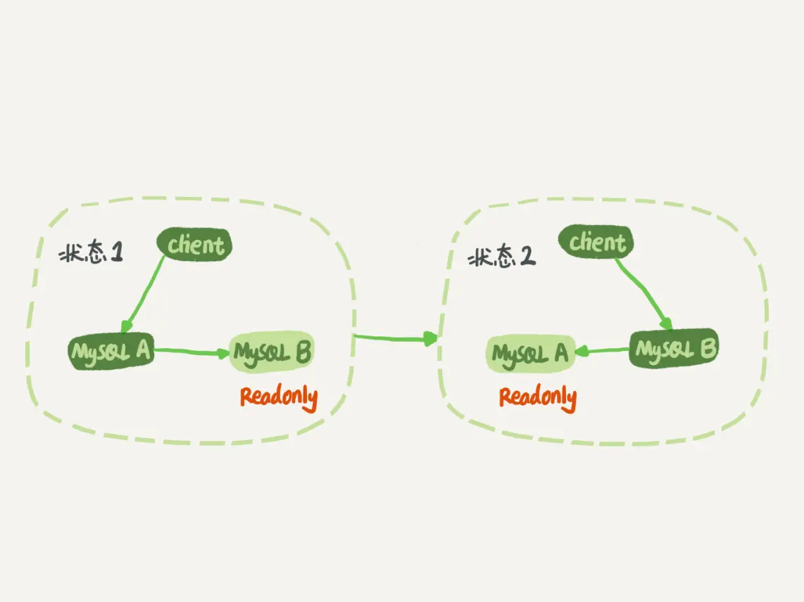
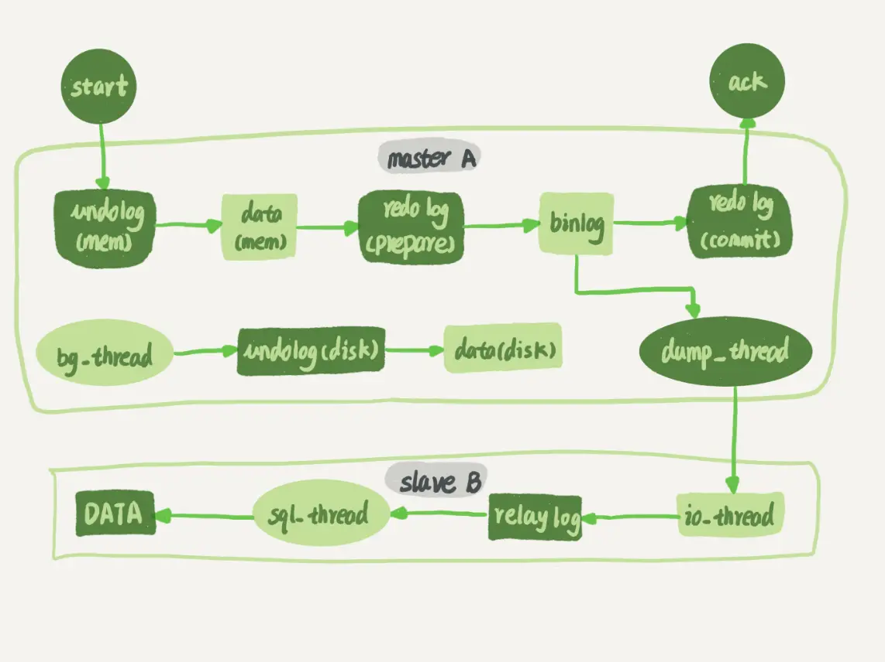

# 一 基础架构示意图


## 各个组件的作用：

### 1、连接器

负责跟客户端建立连接、获取权限、维持和管理连接。 注意： ①用户名密码认证通过，连接器会到权限表里查出你拥有的权限。之后，这个连接里面的权限判断逻辑，都将依赖于此时读到的权限。
②数据库里面长连接是指连接成功后，如果客户端持续有请求，则一直使用同一个连接。短连接则是指每次执行完很少的几次查询就断开连接，下次查询再重新建立一个。
建议尽量使用长连接。但是全部使用长连接后，因为在执行过程中，临时使用的内存是管理在连接对象里面的。这些资源在连接断开的时候才释放，所以如果长连接累积下来， 可能导致内存占用太大，被系统强行抹杀掉（OOM），从现象看就是MySQL异常重启了。
解决办法： 1 定期断开长连接。使用一段时间，或者程序里面判断执行过一个占用内存的大查询后，断开连接，之后要查询再重连。 2 如果你用的是MySQL 5.7或更新版本，可以在每次执行一个比较大的操作后，通过执行
mysql_reset_connection来重新初始化连接资源。这个过程不需要重连和重新做权限验证， 但是会将连接恢复到刚刚创建完时的状态。

### 2、查询缓存

之前执行过的语句及结果会以key-value对的形式，被直接缓存在内存中。不建议使用查询缓存，对于更新压力大的数据表来说，命中率非常低。8.0版本直接将查询缓存的整块功能删掉了。
MySQL提供的“按需使用”的方式，将参数query_cache_type设置成DEMAND，对于默认的SQL语句都不使用查询缓存，而对于确定使用查询缓存的语句，可以用SQL_CACHE显示指定。
```select SQL_CACHE * from T where ID=10```

### 3、分析器

先做“词法分析”，识别出SQL语句里面的字符串分别代表什么，再做“语法分析”，判断你输入的SQL语句是否满足MySQL语法。

### 4、优化器

决定执行方案。有多个索引的时候，决定使用哪个索引；多表关联的时候，决定各表的关联顺序。

### 5、执行器

开始执行的时候，判断当前连接是否有对这个表的查询权限。 在慢查询日志中，rows_examined字段表示这个语句执行过程中扫描了多少行。在有些场景下，执行器调用一次，在引擎内部则扫描了多行，因此引擎扫描行数跟
rows_examined并不是完全相同的。

# redo log和binlog

【说明】  
从整体上看，MySQL就两层。Server层做的是功能层面的事情；引擎层负责存储相关的具体事宜。  
redo log是InnoDB引擎特有的日志，而Server层也有自己的日志，称为binlog（归档日志）。 【不同点】 1、redo log是InnoDB引擎特有的；binlog是MySQL的Server层实现的，所有引擎都可以使用。  
2、redo log是物理日志，记录的是“在某个数据页上做了什么修改”；binlog是逻辑日志，记录的是这个语句的原始逻辑，比如“给ID=2这一行的c字段加1”。 3、redo
log是循环写的，空间固定会用完；binlog是可以追加写入的。“追加写”是指binlog文件写到一定大小后会切换到下一个，并不会覆盖以前的日志。 【参数设置】 ①InnoDB通过redo
log可以保证即使数据库发生异常重启，之前提交的记录都不会丢失。这个能力称为crash-safe。  
②将参数innodb_flush_log_at_trx_commit设置成1，表示每次事务的redo log都直接持久化到磁盘，可以保证MySQL异常重启之后数据不丢失。  
③将参数sync_binlog设置成1，表示每次事务的binlog都持久化到磁盘，可以保证MySQL异常重启之后binlog不丢失。

## redo log


***图解：***  
write pos是当前记录的位置，一边写一边后移，写到第3号文件末尾后就回到0号文件开头。  
checkpoint是当前要擦除的位置，也是往后推移并且循环的，擦除记录前要把记录更新到数据文件。

## 更新语句执行流程


【说明】  
浅色框表示是在InnoDB内部执行的，深色框表示是在执行器中执行的。  
【执行流程】  
①执行器先找引擎取ID=2这一行。ID是主键，引擎直接用树搜索找到这一行。如果ID=2这一行所在的数据页本来就在内存中，就直接返回给执行器；否则，需要先从磁盘读入内存，然后再返回。  
②执行器拿到引擎给的行数据，把这个值加上1，比如原来是N，现在就是N+1，得到新的一行数据，再调用引擎接口写入这行新数据。  
③引擎将这行新数据更新到内存中，同时将这个更新操作记录到redo log里面，此时redo log处于prepare状态。然后告知执行器执行完成了，随时可以提交事务。  
④执行器生成这个操作的binlog，并把binlog写入磁盘。  
⑤执行器调用引擎的提交事务接口，引擎把刚刚写入的redo log改成提交（commit）状态，更新完成。

## 两阶段提交

①跨系统维持数据逻辑一致性时的常用方案；  
②两阶段提交可以保证数据库的状态和用它的日志（binlog）恢复出来的库的状态一致。即redo log丢失，崩溃恢复以后，这个事务无效，原库值不变。binlog丢失，如果用这个binlog恢复临时库的话，
临时库少一次更新，会导致出现主从数据库不一致的情况。

# MySQL写入binlog和redo log的流程
## binlog的写入机制
事务执行过程中，先把日志写到binlog cache，事务提交的时候，再把binlog cache写到binlog文件中，每个线程有自己的binlog cache，但是共用同一份binlog文件  
系统给binlog cache分配一片内存，每个线程一个，参数binlog_cache_size用于控制单个线程内binlog cache所占内存的大小。如果超过了这个参数的规定，就要暂存到磁盘  

图解：  
write：指的就是把日志写到文件系统的page cache，并没有把数据持久化到磁盘，所以速度比较快。  
fsync：才是将数据持久化到磁盘的操作，一般情况下，我们认为fsync才占磁盘的IOPS。  
write 和fsync的时机，是由参数sync_binlog控制的：  
①sync_binlog=0的时候，表示每次提交事务都只write，不fsync；  
②sync_binlog=1的时候，表示每次提交事务都会执行fsync；  
③sync_binlog=N(N>1)的时候，表示每次提交事务都write，但累积N个事务后才fsync。  
因此，在出现IO瓶颈的场景里，将sync_binlog设置成一个比较大的值，可以提升性能。在实际的业务场景中，考虑到丢失日志量的可控性，
一般不建议将这个参数设成0，比较常见的是将其设置为100~1000中的某个数值。但是，将sync_binlog设置为N，对应的风险是：如果主机发生异常重启，
会丢失最近N个事务的binlog日志。

## binlog的三种格式
①statement：binlog里面记录的就是SQL语句的原文
②row：binlog里面记录了真实删除行的主键id  
③mixed：
statement格式的binlog可能会导致主备不一致，而row格式缺陷是占空间，而且写binlog也会耗费IO资源，影响执行速度  
MySQL自己会判断这条SQL语句是否可能引起主备不一致，如果有可能，就用row格式，否则就用statement格式  

## binlog日志详解
①binlog文件会随服务的启动创建一个新文件
②通过flush logs 可以手动刷新日志，生成一个新的binlog文件
③通过show master status 可以查看binlog的状态
④通过reset master 可以清空binlog日志文件
⑤通过mysql binlog 工具可以查看binlog日志的内容
⑥通过执行dml mysql会自动记录binlog
⑦按事件查看日志内容 ```show binlog events in 'mysql-bin.000001'\G```

## redo log的写入机制
事务在执行过程中，生成的redo log是要先写到redo log buffer的，里面的内容不需要每次生成后持久化到磁盘  

redo log存在三种状态  
①存在redo log buffer中，物理上是在MySQL进程内存中，就是图中的红色部分；  
②写到磁盘(write)，但是没有持久化（fsync)，物理上是在文件系统的page cache里面，也就是图中的黄色部分；  
③持久化到磁盘，对应的是hard disk，也就是图中的绿色部分。  
redo log写到redo log buffer是很快的，write到page cache也差不多，但是持久化到磁盘的速度就慢多了  
为了控制redo log的写入策略，InnoDB提供了innodb_flush_log_at_trx_commit参数，它有三种可能取值：  
①设置为0的时候，表示每次事务提交时都只是把redo log留在redo log buffer中;  
②设置为1的时候，表示每次事务提交时都将redo log直接持久化到磁盘；  
③设置为2的时候，表示每次事务提交时都只是把redo log写到page cache。  
有三种场景下会让一个没有提交的事务的redo log写入到磁盘中  
①InnoDB有一个后台线程，每隔1秒，就会把redo log buffer中的日志，调用write写到文件系统的page cache，然后调用fsync持久化到磁盘  
事务执行中间过程的redo log也是直接写在redo log buffer中的，这些redo log也会被后台线程一起持久化到磁盘。也就是说，一个没有提交的事务的redo log，也是可能已经持久化到磁盘的。
②redo log buffer占用的空间即将达到 innodb_log_buffer_size一半的时候，后台线程会主动写盘。  
③并行的事务提交的时候，顺带将这个事务的redo log buffer持久化到磁盘。  

# MySQL主备的基本原理

建议把备库设置成只读模式。防止切换过程中出现双写，造成主备不一致  
readonly设置对超级(super)权限用户是无效的，而用于同步更新的线程，就拥有超级权限  

大致流程是：主库接收到客户端的更新请求后，执行内部事务的更新逻辑，同时写binlog。备库跟主库之间维持一个长连接，主库内部有一个线程，专门用于服务备库
的这个长连接。  
①在备库B上通过change master命令，设置主库A的IP、端口、用户名、密码，以及要从哪个位置开始请求binlog，这个位置包含文件名和日志偏移量。  
②在备库B上执行start slave命令，这时候备库会启动两个线程，就是图中的io_thread和sql_thread。其中io_thread负责与主库建立连接。  
③主库A校验完用户名、密码后，开始按照备库B传过来的位置，从本地读取binlog，发给B。  
④备库B拿到binlog后，写到本地文件，称为中转日志（relay log）。  
⑤sql_thread读取中转日志，解析出日志里的命令，并执行。  


