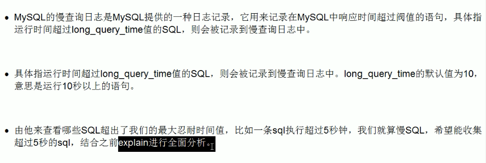

# 一 MySQL Query Optimizer
1、MySQL中有专门负责优化SELECT语句的优化器模块，主要功能：通过计算分析系统中收集到的统计信息，为客户端请求的Query提供
他认为最优的执行计划（他认为最优的数据检索方式，但不见得是DBA认为最优的，这部分最耗费时间）  
2、当客户端向MySQL请求一条Query，命令解析器模块完成请求分类，区别出是SELECT并转发给MySQL Query Optimizer时，
MySQL Query Optimizer首先会对整条Query进行优化，处理掉一些常量表达式的预算，直接换算成常量值。并对Query中的查询
条件进行简化和转换，如去掉一些无用或显而易见的条件、结构调整等。

# 二 Explain
使用explain关键字可以模拟优化器执行SQL语句，从而知道MySQL是如何处理你的SQL语句的。即能分析你的查询语句或结构的性能瓶颈。
## 2.1 能干嘛？
表的读取顺序、数据读取操作的操作类型、哪些索引可以使用、哪些索引被实际使用、表之间的引用、每张表有多少行被优化器查询
## 2.2 各字段解释
①id：select查询的序列号，包含一组数字，表示查询中执行select子句或操作表的顺序  
②select_type：查询的类型，主要用于区别普通查询、联合查询、子查询等复杂查询  
③table：显示这一行的数据是关于哪张表的  
④type：显示查询使用了何种类型；从最好到最差依次是：system>const>eq_ref>ref>range>index>All  
⑤possible_keys：显示可能应用在这张表中的索引，一个或多个。查询涉及的字段上若存在索引，则该索引将被列出，但不一定
被查询实际使用。  
⑥key：实际使用的索引。如果为null则没有使用索引。查询中若使用了覆盖索引，则索引和查询的select字段重叠。  
⑦key_len：表示索引中使用的字节数，可通过该列计算查询中使用的索引的长度。在不损失精确性的情况下，长度越短越好，  
key_len显示的值为索引最大可能长度，并非实际使用长度，即key_len是根据表定义计算而得，不是通过表内检索出的。  
⑧red：显示索引哪一列被使用了，如果可能的话，是一个常数。那些列或常量被用于查找索引列上的值。  
⑨rows：根据表统计信息及索引选用情况，大致估算出找到所需记录所需要读取的行数。  
⑩Extra：  
Using fileSort：  
MySQL有两种方式可以生成有序的结果，通过排序操作或者使用索引，当Extra中出现了Using filesort 说明MySQL使用了前者，但注意虽然叫filesort但并不是说明就是用了文件来进行排序，
可能排序是在内存里完成的。大部分情况下利用索引排序更快，所以一般这时也要考虑优化查询了。使用文件完成排序操作，这里可能是ordery by，group by语句的结果，
这可能是一个CPU密集型的过程，可以通过选择合适的索引来改进性能，用索引来为查询结果排序。  
Using temporary：用临时表保存中间结果，常用于GROUP BY 和 ORDER BY操作中，一般看到它说明查询需要优化了，就算避免不了临时表的使用也要尽量避免硬盘临时表的使用。  
Using index：表示相应的select操作中使用了覆盖索引，避免访问了表的数据行。如果同时出现using where，表明索引被用来执行索引键值的查找；如果没有同时出现using where，
表明索引用来读取数据而非执行查找动作。  
Using where：表明使用了where过滤  
Using join buffer：使用了连接缓存  
impossible where：where子句的值总是false，不能用来获取任何元组；  
select tables optimized away、distinct（出现少）
## 2.3 type详解（显示查询使用了何种类型）
①system：表只有一行记录（等于系统表），这是const类型的特例，平时不会出现，可以忽略不计；  
②const：表示通过索引一次就找到了，const用于比较primary key或者unique索引。因为只匹配一行数据，所以很快。如将主键置于where列表中，MySQL就能将该查询转换为一个常量；  
③eq_ref：唯一性索引，对于每个索引建，表中只有一条记录与之匹配，常见于主键或唯一索引扫描；  
④ref：非唯一索引扫描，返回匹配某个单独值的所有行。本质上也是一种索引访问，它返回所有匹配某个单独值的行，然而，它可能会找到多个符合条件的行，所以他应该属于查找和扫描的混合体；  
⑤range：只检索给定范围的行，使用一个索引来选择行。key列显示使用了哪个索引，一般就是在你的where语句中出现了between、<、>、in等的查询，这种范围索引扫描比全表扫描好，因为他只需要开始索引
的某一点，而结束另一点，不用扫描全部索引。
⑥index：与All区别为index类型只遍历索引树。这通常比All快，因为索引文件通常比数据文件小。（也就是说虽然all和index都是读全表，但是index是从索引中读取的，而all是从硬盘中读的）  
⑦all：将遍历全表以找到匹配的行

# 三 查询优化
步骤：  
①开启慢查询日志，设置阈值，比如超过1秒钟的就是慢SQL，然后让系统运行一段时间，将慢SQL抓取出来  
②explain + 慢SQL分析  
③show profile查询SQL在mysql服务器里面的执行细节和生命周期情况  
④DBA进行SQL数据库服务器的参数调优

## 3.1 永远小表驱动大表
1、in  
```
select * from A where id in (select id from B)
```
*当B表的数据集小于A表的数据集时，用in优于exists*
2、exists
```
select * from A where exists (select 1 from B where B.id = A.id)
```
*当A表的数据集小于B表的数据集时，用exists优于in*
理解：将主查询的数据，放到子查询中做条件验证，根据验证结果（TRUE或FALSE）来决定主查询的数据结果是否得以保留。  
注意：  
①EXISTS(subQuery)只返回TRUE或FALSE，因此子查询中的SELECT *也可以是SELECT 1或SELECT 'X'，官方说法是实际执行时会忽略SELECT清单，因此没有区别  
②EXISTS子查询的实际执行过程可能经过了优化而不是我们理解上的逐条对比，如果担忧效率问题，可进行实际校验以确定是否有效率问题  
③EXISTS子查询往往也可以用条件表达式、其他子查询或者JOIN来替代，何种最优需要具体问题具体分析

## 3.2 order by关键字优化
①order by子句，尽量使用index方式排序，避免使用file sort方式排序  
> MySQL支持两种方式的排序：FileSort和Index。Index效率高，它指MySQL扫描索引本身完成排序。FileSort方式效率较低。  
> Order By满足两种情况，会使用Index方式排序：  
> ①Order by语句使用索引最左前列  
> ②使用where子句与order by子句条件组合满足索引最左前列

②尽可能在索引列上完成排序操作，遵照索引建的最佳左前缀法则。如果不在索引列上，FileSort有两种算法：双路排序和单路排序。  
> 双路排序：
> MySQL4.1之前使用双路排序，字面意思是两次扫描磁盘，最终得到数据。读取行指针和order by列，对他们进行排序，然后扫描已经排序好的列表，
> 按照列表中的值重新从列表中读取对应的数据传输。从磁盘排序字段，在buffer进行排序，再从磁盘取其他字段  
> 单路排序：  
> 从磁盘读取查询需要的所有列，按照order by列在buffer对他们进行排序，然后扫描排序后的列表进行输出，它的效率更快一些，避免了第二次读取数据，并且把
> 随机IO变成顺序IO，但是它会使用更多的空间，因为它把每一行都保存在内存中了。
> 
> 
> 总结：  
> ①增大sort_buffer_size参数的设置  
> ②增大max_length_for_sort_data参数的设置  
> 

## 3.3 group by关键字优化
> ①group by实质是先排序后进行分组，遵照索引建的最佳左前缀  
> ②当无法使用索引列，增大max_length_for_sort_data参数的设置+增大sort_buffer_size参数的设置
> ③where高于having，能写在where限定的条件就不要去having限定了

# 四 慢查询日志

默认情况下，MySQL数据库没有开启慢查询日志，需要我们手动来设置这个参数。当然，如果不是调优需要的话，一般不建议启动该参数，因为开启慢查询日志会或多或少带来一定的性能影响。慢查询日志
支持将日志记录写入文件。
```
show variables like '%slow_query_log%'  
值为OFF，默认情况下慢查询日志是禁用的
set global slow_query_log=1  
开启了慢查询日志，只对当前数据库有效，如果mysql重启后则会失效。永久生效的办法，修改my.cnf文件  

```


