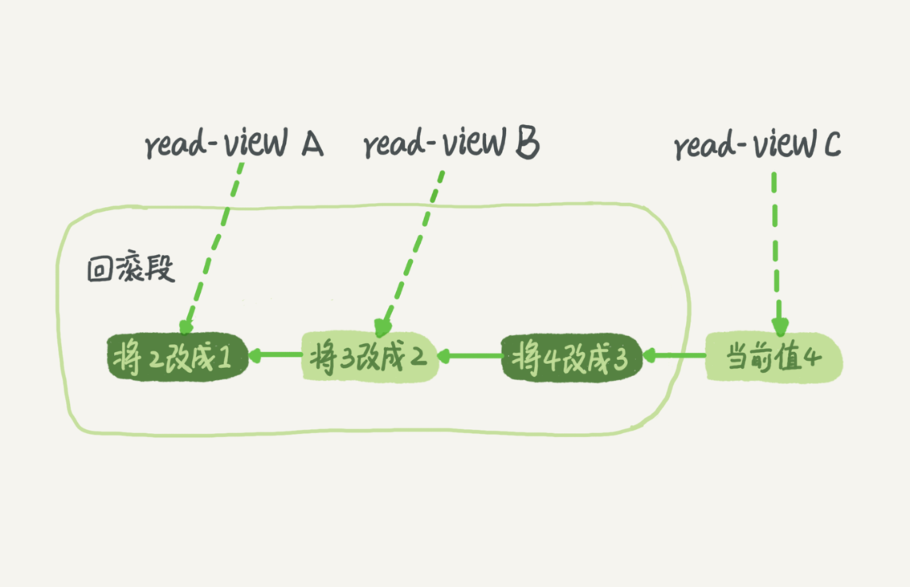

# 一 并发事务处理带来的问题
①更新丢失  
  
②脏读  
  
③不可重复读  
  
④幻读  


# 二 事务及其ACID属性


# 三 事务隔离级别
【概念】  
"脏读"、“不可重复读“、”幻读“，其实都是数据库读一致性问题，必须由数据库提供一定的事务隔离机制来解决。
事务隔离实质上就是使事务在一定程度上“串行化”进行，显然与“并发”是矛盾的。  
【查看当前数据库事务隔离级别】  
```show variables like 'tx_isolation'```

| 读数据一致性及允许的并发副作用隔离级别 | 读数据一致性 | 脏读 | 不可重复读 | 幻读 | 含义 |
|  ---  |  ---  |  ---  |   ---  |  ---  |  ---  |
| 读未提交 | 最低级别，只能保证不读物理上损坏的数据 | √ | √ | √ | 一个事务还没提交时，它做的变更就能被别的事务看到。 |
| 读已提交 | 语句级 | × | √ | √ | 一个事务提交之后，它做的变更才会被其他事务看到。 |
| 可重复读 | 事务级 | × | × | √ | 一个事务执行过程中看到的数据，总是跟这个事务在启动时看到的数据是一致的。当然在可重复读隔离级别下，未提交变更对其他事务也是不可见的。 |
| 可序列化 | 最高级别，事务级 | × | × | × | 对于同一行记录，“写”会加“写锁”，“读”会加“读锁”。当出现读写锁冲突的时候，后访问的事务必须等前一个事务执行完成，才能继续执行。 |

【隔离级别实现原理】  
在实现上，数据库里面会创建一个视图，访问的时候以视图的逻辑结果为准。在“可重复读”隔离级别下，这个视图是在事务启动时创建的，整个事务存在期间都用这个视图。在“读已提交”隔离级别下，
这个视图是在每个SQL语句开始执行的时候创建的。这里需要注意的是，“读未提交”隔离级别下直接返回记录上的最新值，没有视图概念；而“串行化”隔离级别下直接用加锁的方式来避免并行访问。
我们可以看到在不同的隔离级别下，数据库行为是有所不同的。Oracle数据库的默认隔离级别其实就是“读提交”，因此对于一些从Oracle迁移到MySQL的应用，为保证数据库隔离级别的一致，
你一定要记得将MySQL的隔离级别设置为“读提交”。配置的方式是，将启动参数transaction-isolation的值设置成READ-COMMITTED。你可以用show variables来查看当前的值。

【查看隔离级别】  
```show variables like 'transaction_isolation'```

【事务隔离实现原理】  


# 四 锁
## 表锁（偏读）
【概念】  
偏向MyISAM存储引擎，开销小，加锁快，无死锁，锁定粒度大，发生锁冲突概率最高，并发最低。MyISAM在执行查询语句前，会自动给涉及的所有表加读锁，在执行增删改操作前，会自动给涉及的表加写锁。   
```
lock table 表名字 read(write),表名字 read(write)  （手动增加表锁）
show open tables                                （查看表上加过的锁）
unlock tables                                   （释放表锁）
```
【表锁定分析】  
```
show status like 'table%'  
值1：Table_locks_immediate：产生表级锁定的次数，表示可以立即获取锁的查询次数，每立即获取锁值加1  
值2：出现表级锁定争用而发生等待的次数（不能立即获取锁的次数，每等待一次锁值加1），此值高说明存在着较严重的表级锁争用情况
```
【特点】  
①读锁会阻塞写，但是不会阻塞读。而写锁则会把读和写都阻塞。  
②MyISAM的读写锁调度是写优先，这也是MyISAM不适合做写为主表的引擎。因为写锁导致其他线程不能做任何操作，大量的更新会使查询很难得到锁，从而造成永远阻塞。

## 写锁（偏写）
【概念】  
偏向InnoDB存储引擎，开销大，加锁慢，会出现死锁，锁定粒度最小，发生锁冲突的概率最低，并发度也最高。  
【间隙锁问题】  

结论：在使用不当的时候，InnoDB的整体性能表现不仅不能比MyISAM高，甚至可能会更差。  
【行锁定分析】  
```
show status like 'innodb_row_lock%';  
值1：innodb_row_lock_current_waits    当前正在等待锁定的数量；  
值2：innodb_row_lock_time             从系统启动到现在锁定总时间长度（常用）  
值3：innodb_row_lock_time_avg         每次等待所花平均时间（常用）  
值4：innodb_row_lock_time_max         从系统启动到现在等待最长的一次所花的时间  
值5：innodb_row_lock_waits            系统启动后到现在总共等待的次数（常用）
```
【其他问题】  
①varchar不用''导致系统自动转换类型，行锁变表锁  
②select ... for update 锁定某一行后，其它的操作会被阻塞，直到锁定行的会话提交commit  
【优化建议】  
①尽可能让所有数据检索都通过索引来完成，避免无索引行锁升级为表锁  
②合理设计索引，尽量缩小锁的范围  
③尽可能较少检索条件，避免间隙锁  
④尽量控制事务大小，减少锁定资源量和时间长度  
⑤尽可能低级别事务隔离  

## 页锁
开销和加锁时间界于表锁和行锁之间：会出现死锁，锁定粒度界于表锁和行锁之间，并发度一般

# 五 事务


