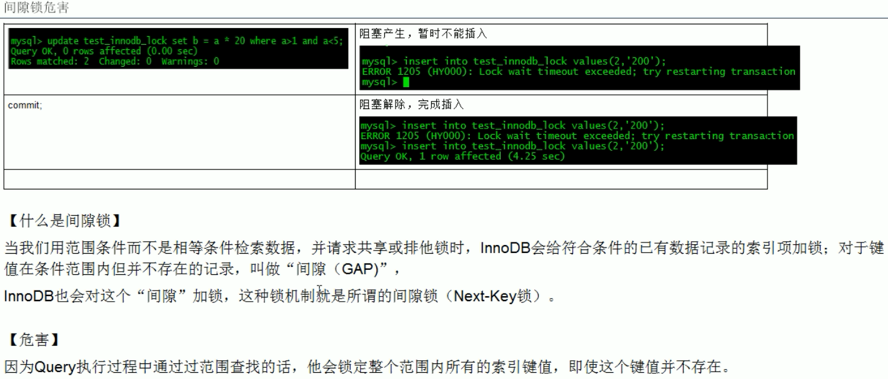

# 一 并发事务处理带来的问题
①更新丢失  
  
②脏读  
  
③不可重复读  
  
④幻读  


# 二 事务及其ACID属性


# 三 事务隔离级别
【概念】  
"脏读"、“不可重复读“、”幻读“，其实都是数据库读一致性问题，必须由数据库提供一定的事务隔离机制来解决。
事务隔离实质上就是使事务在一定程度上“串行化”进行，显然与“并发”是矛盾的。  
【查看当前数据库事务隔离级别】  
```show variables like 'tx_isolation'```

| 读数据一致性及允许的并发副作用隔离级别 | 读数据一致性 | 脏读 | 不可重复读 | 幻读 | 含义 |
|  ---  |  ---  |  ---  |   ---  |  ---  |  ---  |
| 读未提交 | 最低级别，只能保证不读物理上损坏的数据 | √ | √ | √ | 一个事务还没提交时，它做的变更就能被别的事务看到。 |
| 读已提交 | 语句级 | × | √ | √ | 一个事务提交之后，它做的变更才会被其他事务看到。 |
| 可重复读 | 事务级 | × | × | √ | 一个事务执行过程中看到的数据，总是跟这个事务在启动时看到的数据是一致的。当然在可重复读隔离级别下，未提交变更对其他事务也是不可见的。 |
| 可序列化 | 最高级别，事务级 | × | × | × | 对于同一行记录，“写”会加“写锁”，“读”会加“读锁”。当出现读写锁冲突的时候，后访问的事务必须等前一个事务执行完成，才能继续执行。 |

【隔离级别实现原理】  
在实现上，数据库里面会创建一个视图，访问的时候以视图的逻辑结果为准。在“可重复读”隔离级别下，这个视图是在事务启动时创建的，整个事务存在期间都用这个视图。在“读已提交”隔离级别下，
这个视图是在每个SQL语句开始执行的时候创建的。这里需要注意的是，“读未提交”隔离级别下直接返回记录上的最新值，没有视图概念；而“串行化”隔离级别下直接用加锁的方式来避免并行访问。
我们可以看到在不同的隔离级别下，数据库行为是有所不同的。Oracle数据库的默认隔离级别其实就是“读提交”，因此对于一些从Oracle迁移到MySQL的应用，为保证数据库隔离级别的一致，
你一定要记得将MySQL的隔离级别设置为“读提交”。配置的方式是，将启动参数transaction-isolation的值设置成READ-COMMITTED。你可以用show variables来查看当前的值。

【查看隔离级别】  
```show variables like 'transaction_isolation'```

【事务隔离实现原理】  

> 尽量不要使用长事务的原因：  
> 记录在更新的时候，都会同时记录一条回滚操作。不同时刻启动的事务会有不同的read-view，对于指定的read-view，要得到对应的该记录的值，就必须将当前值依次执行所有的回滚操作到
> 指定事务那一个时刻对应的回滚操作。因此回滚日志会被保留至当没有事务需要用到这些回滚日志时，回滚日志才会被删除。
> 而长事务意味着系统里面会存在很老的事务视图，由于这些事务随时可能访问数据库里面的任何数据，所以这个事务提交之前，数据库里面它可能用到的回滚记录都必须保留，这就会导致大量占用存储空间。  
> 除了对回滚段的影响，长事务还占用锁资源，也可能拖垮整个库。

【事务的启动方式】  
①显示启动事务语句，begin或start transaction，对应的提交语句是commit，回滚语句是rollback；  
②set autocommit = 0，这个命令会将这个线程的自动提交关闭，意味着如果你只执行一个select语句，这个事务就启动了，而且并不会自动提交。这个事务持续存在直到你主动执行commit或rollback
语句，或者断开连接。这种启动方式在开始时都不需要主动执行一次“begin”，减少了语句的交互次数，但是因为接下来的查询都在事务中，如果是长链接，就导致了意外的长事务。  
因此建议在autocommit=1的情况下，用begin显示启动事务，执行commit work and chain，表示提交事务并自动启动下一个事务，这样也省去了再次执行begin语句的开销。
**建议：使用set autocommit = 1，通过显示语句的方式来启动事务。**
```
select * from information_schema.innodb_trx where TIME_TO_SEC(timediff(now(),trx_started))>60（查找持续时间超过60s的事务）
```

> 避免长事务对业务的影响    
> 应用开发端注意事项：  
> 1、确认是否使用了set autocommit=0。这个确认工作可以在测试环境中开展，把MySQL的general_log开起来，然后随便跑一个业务逻辑，通过general_log的日志来确认。
> 一般框架如果会设置这个值，也就会提供参数来控制行为，你的目标就是把它改成1。  
> 2、确认是否有不必要的只读事务。有些框架会习惯不管什么语句先用begin/commit框起来。我见过有些是业务并没有这个需要，但是也把好几个select语句放到了事务中。这种只读事务可以去掉。
> 3、业务连接数据库的时候，根据业务本身的预估，通过SET MAX_EXECUTION_TIME命令，来控制每个语句执行的最长时间，避免单个语句意外执行太长时间。  
> 
> 数据库端注意事项：  
> 1、监控 information_schema.Innodb_trx表，设置长事务阈值，超过就报警/或者kill；
> 2、Percona的pt-kill这个工具不错，推荐使用；
> 3、在业务功能测试阶段要求输出所有的general_log，分析日志行为提前发现问题；
> 4、如果使用的是MySQL 5.6或者更新版本，把innodb_undo_tablespaces设置成2（或更大的值）。如果真的出现大事务导致回滚段过大，这样设置后清理起来更方便。

# 四 锁
## 表锁（偏读）
【概念】  
偏向MyISAM存储引擎，开销小，加锁快，无死锁，锁定粒度大，发生锁冲突概率最高，并发最低。MyISAM在执行查询语句前，会自动给涉及的所有表加读锁，在执行增删改操作前，会自动给涉及的表加写锁。   
```
lock table 表名字 read(write),表名字 read(write)  （手动增加表锁）
show open tables                                （查看表上加过的锁）
unlock tables                                   （释放表锁）
```
【表锁定分析】  
```
show status like 'table%'  
值1：Table_locks_immediate：产生表级锁定的次数，表示可以立即获取锁的查询次数，每立即获取锁值加1  
值2：出现表级锁定争用而发生等待的次数（不能立即获取锁的次数，每等待一次锁值加1），此值高说明存在着较严重的表级锁争用情况
```
【特点】  
①读锁会阻塞写，但是不会阻塞读。而写锁则会把读和写都阻塞。  
②MyISAM的读写锁调度是写优先，这也是MyISAM不适合做写为主表的引擎。因为写锁导致其他线程不能做任何操作，大量的更新会使查询很难得到锁，从而造成永远阻塞。

## 写锁（偏写）
【概念】  
偏向InnoDB存储引擎，开销大，加锁慢，会出现死锁，锁定粒度最小，发生锁冲突的概率最低，并发度也最高。  
【间隙锁问题】  

结论：在使用不当的时候，InnoDB的整体性能表现不仅不能比MyISAM高，甚至可能会更差。  
【行锁定分析】  
```
show status like 'innodb_row_lock%';  
值1：innodb_row_lock_current_waits    当前正在等待锁定的数量；  
值2：innodb_row_lock_time             从系统启动到现在锁定总时间长度（常用）  
值3：innodb_row_lock_time_avg         每次等待所花平均时间（常用）  
值4：innodb_row_lock_time_max         从系统启动到现在等待最长的一次所花的时间  
值5：innodb_row_lock_waits            系统启动后到现在总共等待的次数（常用）
```
【其他问题】  
①varchar不用''导致系统自动转换类型，行锁变表锁  
②select ... for update 锁定某一行后，其它的操作会被阻塞，直到锁定行的会话提交commit  
【优化建议】  
①尽可能让所有数据检索都通过索引来完成，避免无索引行锁升级为表锁  
②合理设计索引，尽量缩小锁的范围  
③尽可能较少检索条件，避免间隙锁  
④尽量控制事务大小，减少锁定资源量和时间长度  
⑤尽可能低级别事务隔离  

## 页锁
开销和加锁时间界于表锁和行锁之间：会出现死锁，锁定粒度界于表锁和行锁之间，并发度一般

# 五 事务


