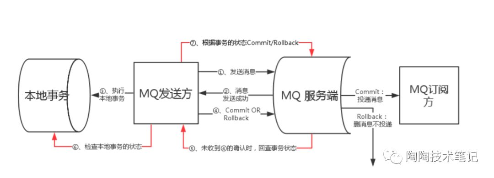

# 消费模式
### pull模式
由消费者客户端主动向消息中间件（MQ消息服务器代理）拉取消息；采用Pull方式，如何设置Pull消息的拉取频率需要重点去考虑，举个例子来说，可能1分钟内连续来了1000条消息，
然后2小时内没有新消息产生（概括起来说就是“消息延迟与忙等待”）。如果每次Pull的时间间隔比较久，会增加消息的延迟，即消息到达消费者的时间加长，MQ中消息的堆积量变大；
若每次Pull的时间间隔较短，但是在一段时间内MQ中并没有任何消息可以消费，那么会产生很多无效的Pull请求的RPC开销，影响MQ整体的网络性能

### push模式
由消息中间件（MQ消息服务器代理）主动地将消息推送给消费者；采用Push方式，可以尽可能实时地将消息发送给消费者进行消费。但是，在消费者的处理消息的能力较弱的时候(比如，
消费者端的业务系统处理一条消息的流程比较复杂，其中的调用链路比较多导致消费时间比较久。概括起来地说就是“慢消费问题”)，而MQ不断地向消费者Push消息，消费者端的缓冲区可能会溢出，导致异常

# Rocket MQ
### 消费者与主题的分配关系
首先是每个consumer实例平均分配queue。然后RocketMQ会将这些Queue再平均分配至属于同一个Group ID的订阅方集群  

① 如果消费者consumer机器数量和消息队列相等，则消息队列平均分配到每一个consumer上  
② 如果consumer数量大于消息队列数量，则超出消息队列数量的机器没有可以处理的消息队列  
③ 若消息队列数量不是consumer的整数倍，则部分consumer会承担跟多的消息队列的消费任务  

一定要保证消费端的消费性能高于生产端的发送性能，这样的系统才能健康的持续运行。在扩容consumer的实例数量的同时，必须同步扩容主题中的分区（也叫队列）数量，确保consumer的实例数和
分区数量是相等的。如果consumer的实例数量超过分区数量，这样的扩容实际上是没有效果的。因为对于消费者来说，在每个分区上实际上只能支持单线程消费  

### 事务消息在一阶段对用户不可见
首先是，事务消息相对普通消息最大的特点是在一阶段发送的消息对用户是不可见的。那么，如何做到写入消息但是对用户不可见呢？如果是half消息，将备份原消息的主题与消息消费队列，然后改变主题为
```RMQ_SYS_TRANS_HALF_TOPIC```。由于消费组未订阅该主题，所以消费端无法消费half类型的消息。然后二阶段会显示执行提交或回滚half消息（逻辑删除）。当然为了防止二阶段操作失败，
RocketMQ会开启一个定时任务，从主题为```RMQ_SYS_TRANS_HALF_TOPIC```中拉取消息进行消费，根据生产组获取一个服务提供者发送回查事务状态请求，根据事务状态来决定是提交或回滚消息。  

RocketMQ的具体实现策略是：写入的如果是事务消息，对消息的Topic和Queue等属性进行替换，同时将原来的Topic和Queue存储到消息的属性中，正因为消息主题被替换，故消息并不会转发到该原
主题的消息消费队列，消费组无法感知消息的存在，不会消费。其实改变消息主题是RocketMQ的常用套路。

# 事务消息
事务消息就是用来保证```本地事务```和```MQ消息发送```的原子性  



# 过滤消息

