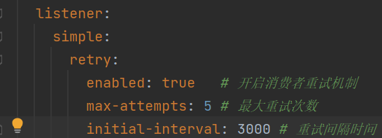
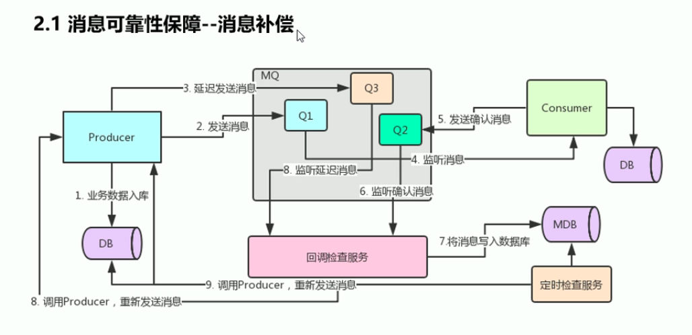
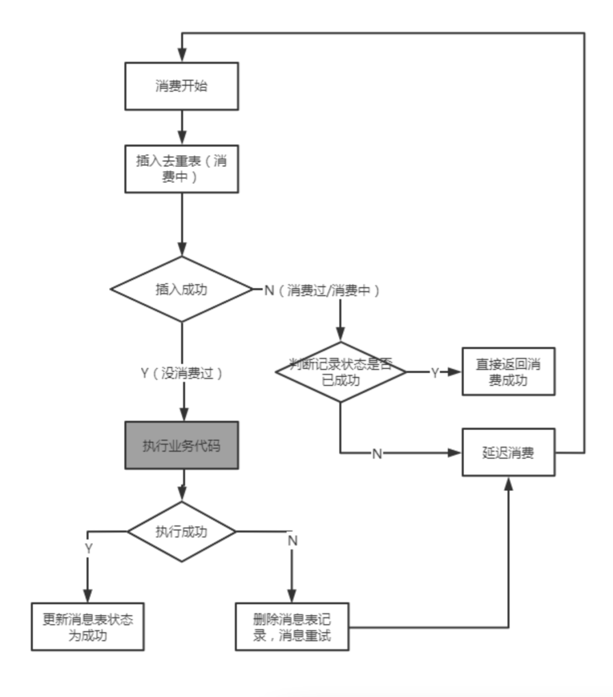
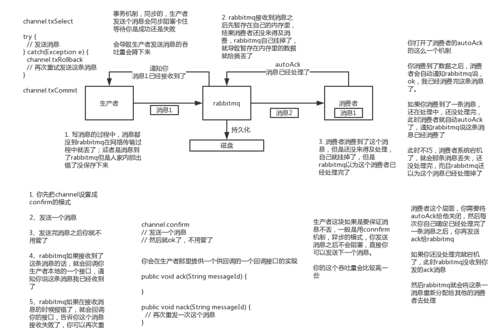
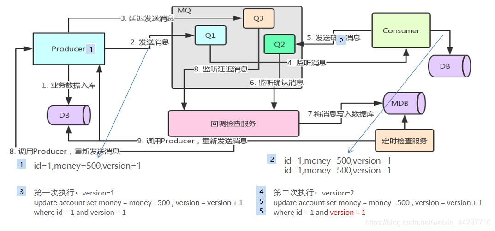

# 一 消息应答

1、消费者在接收到消息并处理后，告诉rabbitmq它已经处理了，rabbitmq可以把该消息删除了。 2、消息应答的方法 用于肯定确认： channel.basicAck(deliveryTag,multiple)
。multiple的true代表批量应答channel上未应答的消息，false代表只应答指定tag的消息。 用于否定确认： channel.basicNack(deliveryTag,multiple,requeue)
。第三个参数如果设置为true，则消息重新回到queue，broker会重新发送该消息给消费端。 channel.basicReject()。与channel.basicNack()相比少一个参数，不处理该消息了直接拒绝，可以将其丢弃了。
3、消息重新入队 如果消费者由于某些原因失去连接（其通道关闭，连接已关闭或TCP连接丢失），导致消息未发送ACK确认，Rabbit MQ了解到消息未完全处理，
并将对其重新排队。如果此时其他消费者可以处理，它将很快将其重新分发给另一个消费者。这样，即使某个消费者偶尔死亡， 也可以确保不会丢失任何消息。

# 三 RabbitMQ不公平分发

channel.basicQos(1);

# 四 RabbitMQ预取值

因为消息的发送是异步的，并且消费者的手动确认本质上也是异步的，所以channel上肯定不止只有一个消息。因此希望开发人员
能限制未确认的消息缓冲区的大小，通过使用basic.ops方法设置“预取值”来完成。该值定义通道上允许的未确认消息的最大数量。 一旦数量达到配置的数量，RabbitMQ 将停止在通道上传递更多消息，除非至少有一个未处理的消息被确认，

# 五 如何处理异步未确认消息？？？

最好的解决方案就是把未确认的消息放到一个基于内存的能被发布线程访问的队列，比如说用ConcurrentLinkedQueue这个队列在 Confirm callbacks与发布线程之间进行消息的传递。

# 六 交换机类型

1、默认（或无名）交换机（常用""空字符串代表） 2、直连交换机（direct） 3、扇出交换机（fanout） 4、主题交换机（Topic）

# 七 TTL

既可以给消息设置TTL属性，又可以给队列设置TTL属性。如果同时配置，较小的值将会被使用。 1、如果设置了队列的TTL属性，那么一旦消息过期，就会被丢弃，如果配置了死信队列，就会被丢到死信队列中。
使用参数：x-message-ttl，单位：ms 2、如果设置了消息的TTL属性，那么一旦消息过期，也不一定会被丢弃，因为消息是否过期是**在即将投递到消费者之前判定**的， new MessagePostProcessor(){ ...
message.getMessageProperties.setExpiration("1000"); // 单位：ms ... } 注意：如果当前队列有严重的消息积压情况，则已过期的消息也许还能存活较长时间；
另外，还需要注意的一点是，如果不设置 TTL，表示消息永远不会过期，如果将 TTL 设置为 0，则表示除非此时可以直接投递该消息到消费者， 否则该消息将会被丢弃。

# 八 死信队列

正常消息变成死信的条件： 1、消息ttl过期 AMQP.BasicProperties properties = new AMQP.BasicProperties().builder().expiration("10000")
.build(); 2、队列达到最大长度 params.put("x-max-length",6);（设置正常队列长度的限制） 3、消息被拒 channel.basicNack(); channel.basicReject(
delivery.getEnvelope().getDeliveryTag(), false); 并且设置 requeue=false ，代表拒绝重新入队，否则如果配置了死信交换机将发送到死信队列中
***做法：***
给队列设置参数：x-dead-letter-exchange和x-dead-letter-routing-key

# 九 延迟队列

用来存放在指定时间被处理的元素的队列。队列内部是有序的。

## 问题

1、设置队列的TTL属性，可以保证消息被延迟消费，但是如果要实现消息粒度上的TTL，即通过给消息指定TTL，实现任意时间延迟消费，
这里面存在的问题就是消息可能并不会按时“死亡”，因为rabbitmq只会检查第一个消息是否过期，如果过期则丢弃或被丢到死信队列， 如果第一个消息的延迟时长很长，而第二个消息的延迟时长很短，其实第二个消息并不会优先得到执行。

## 解决办法

通过Rabbit MQ插件实现消息粒度上的TTL，可以让消息在设置的TTL时间及时死亡。

# 其他

## 延迟队列的选择

延迟队列的选择有Java的DelayQueue、Redis的zSet、Quartz、Kafka的时间轮等。

## 消费端限流

1、确保ACK机制为手动确认； 2、perfetch=1；（表示消费端每次从MQ拉取一条消息来消费，直到手动确认消费完毕后，才会继续拉取下一条消息）

## 消息追踪

1、FireHose 机制是将生产者投递给rabbitmq的消息，rabbitmq投递给消费者的消息a按照指定的格式发到默认的exchange上。
这个默认的交换机的名称是amqp.rabbitmq.trace，它是一个topic类型的交换机。 开启FireHose的命令：rabbitmqctl trace_on 关闭FireHose的命令：rabbitmqctl
trace_off  
2、rabbitmq_tracing 启用插件：rabbitmq-plugins enable rabbitmq_tracing

# 高级篇

# 十 消息的可靠投递

## 10.1 持久化

1、队列实现持久化 在声明队列的时候把durable参数设置为持久化  
2、消息实现持久化 让消息实现持久化需要修改消息生产者代码，添加Message.PERSISTENT_TEXT_PLAIN这个属性  
3、交换机持久化

## 10.2 手动应答（ACK）

表示消费端收到消息之后的确认方式 1、自动确认：acknowledge="none"
2、手动确认：acknowledge="manual"
3、根据异常情况确认：acknowledge="auto"（，使用麻烦，不常用）

要确保消息成功发送，只需做好三件事即可：  
1、确认消息到达Exchange  
2、确认消息到达Queue  
3、开启定时任务，定时投递那些发送失败的消息

## 10.3 开启事务机制（事务模式效率低下）

首先需要提供一个事务管理器

```
@Bean
RabbitTransactionManager transactionManager(ConnectionFactory connectionFactory) {
    return new RabbitTransactionManager(connectionFactory);
}
```

在消息生产者上面做两件事：添加事务注解并设置通信信道为事务模式

```
@Service
public class MsgService {
    @Autowired
    RabbitTemplate rabbitTemplate;

    @Transactional      // 发送消息的方法上添加@Transactional注解标记事务
    public void send() {
        rabbitTemplate.setChannelTransacted(true);      // 开启事务模式
        rabbitTemplate.convertAndSend(RabbitConfig.JAVABOY_EXCHANGE_NAME,RabbitConfig.JAVABOY_QUEUE_NAME,"hello rabbitmq!".getBytes());
        int i = 1 / 0;
    }
}
```

生产者发送消息的步骤：  
1、客户端发出请求，将信道设置为事务模式。  
2、服务端给出回复，同意将信道设置为事务模式。  
3、客户端发送消息。 （除了第三步是本来就有的，其他几个步骤都是平白无故多出来的） 4、客户端提交事务。  
5、服务端给出响应，确认事务提交。

## 10.4 发布确认模式

生产者将信道设置成confirm模式，一旦信道进入confirm模式，所有在该信道上面发布的消息都将会被指派一个唯一的ID。 一旦消息被投递到所有匹配的队列之后，broker就会发送一个确认给生产者(包含消息的唯一 ID)
，这就使得生产者知道消息已经正确 到达目的队列了，如果消息和队列是可持久化的，那么确认消息会在将消息写入磁盘之后发出，broker 回传给生产者的确认消息中 delivery-tag 域包含了确认消息的序列号，此外 broker
也可以设置basic.ack 的 multiple 域，表示到这个序列号之前的所有消息 都已经得到了处理。在Rabbit MQ重启期间，生产者消息投递失败，导致消息丢失，可以开启发布确认模式。 1、confirm模式
①在仅开启生产者确认机制的情况下，交换机接收到消息后，会直接给消息生产者发送确认消息。 做法： spring.rabbitmq.publisher-confirm-type=correlated（发布消息成功到交换机后会触发回调方法）
implements RabbitTemplate.confirmCallback {}（交换机的确认回调接口） 2、return模式 ②但是发现消息不可路由，那么该消息会被直接丢弃，此时生产者是不知道消息被丢弃这个事件的。 做法：
spring.rabbitmq.publisher-returns=true（此配置表示一旦路由错误，交换机会回退消息给生产者） implements RabbitTemplate.ReturnCallback()
（交换机的回退接口，即在消息传递过程中不可达目的地时将消息返回给生产者）

```
@Configuration
public class RabbitConfig implements RabbitTemplate.ConfirmCallback, RabbitTemplate.ReturnsCallback {
    public static final String JAVABOY_EXCHANGE_NAME = "javaboy_exchange_name";
    public static final String JAVABOY_QUEUE_NAME = "javaboy_queue_name";
    private static final Logger logger = LoggerFactory.getLogger(RabbitConfig.class);
    @Autowired
    RabbitTemplate rabbitTemplate;
    @Bean
    Queue queue() {
        return new Queue(JAVABOY_QUEUE_NAME);
    }
    @Bean
    DirectExchange directExchange() {
        return new DirectExchange(JAVABOY_EXCHANGE_NAME);
    }
    @Bean
    Binding binding() {
        return BindingBuilder.bind(queue())
                .to(directExchange())
                .with(JAVABOY_QUEUE_NAME);
    }

    @PostConstruct      // 因为两个接口的实现类是rabbitTemplate对象的内部属性，所以要使用特殊的注入方式，将目标对象注入给rabbitTemplate对象
    public void initRabbitTemplate() {
        rabbitTemplate.setConfirmCallback(this);
        rabbitTemplate.setReturnsCallback(this);
    }

    @Override
    public void confirm(CorrelationData correlationData, boolean ack, String cause) {
        if (ack) {
            logger.info("{}:消息成功到达交换器",correlationData.getId());
        }else{
            logger.error("{}:消息发送失败", correlationData.getId());
        }
    }

    @Override
    public void returnedMessage(ReturnedMessage returned) {
        logger.error("{}:消息未成功路由到队列",returned.getMessage().getMessageProperties().getMessageId());
    }
}
```

***注意事项：*** 生产者回退消息与备份交换机同时开启的时候，不可路由的消息会被发送到备份交换机。

# 十三 自动补偿机制（消费者处理消息）

在RabbitMQ里，如果消费者在处理消息时，业务逻辑出现异常，默认会执行补偿机制（也就是消息重试机制）。如果业务逻辑出现异常，是不会消费消息的。  
原理：  
①@RabbitListener 底层使用了AOP进行拦截，如果程序没有抛异常，自动提交事务。  
②如果AOP使用异常通知拦截获取异常信息的话，自动实现补偿机制，该消息会缓存到RabbitMQ服务端进行缓存，一直重试到不抛异常为准。  
配置重试的次数与时间：  

说明：消费者获取到消息后，有一些情况需要重试机制（如调用第三方接口，但接口暂时无法访问...），有一些情况不需要重试机制（如抛出空指针异常...），因为 异常的代码是一直都会有异常的。

# 十三 消息可靠性保障（高级篇）

1、消息补偿机制  
  
简单说明：  
消息补偿机制需要建立在业务数据库和MQ数据库的基础之上 , 当我们发送消息时 , 需要同时将消息数据保存在数据库中, 两者的状态必须记录。 然后通过业务数据库和MQ数据库的对比检查消费是否成功，不成功，进行消息补偿措施，重新发送消息处理
①消息补偿机制核心 : 发现未成功消费的消息, 并且重新发送消息  
②消息回调检查服务 : 发送正常消息同时发送一个延迟消息, 当监听到延迟消息的时候, 检查MDB中是否有消费记录 , 如果没有代表存在消息丢失, 重新发送消息  
③消息定时检查服务 : 设置定时任务, 定时比对业务DB和MDB ,中的数据是否一致, 如果不一致一定存在消息丢失, 重新发送

# 十四 消息幂等性保障
## 14.1 消息去重解决方案
简单处理：通过唯一id去重，再次消费时去数据库中查一次，若已经存在，则不消费  
复杂处理：并发场景下，可能在没成功消费之前，又有一条消息到来，那么就会导致重复的消费逻辑被执行，从而引发重复消费的问题（如主键冲突抛出异常、库存被重复扣减而没释放等）  
并发场景下的解决方案：  
①开启事务，把select改成select ... for update  
②更新状态采取乐观锁  
③分布式场景下，采取消息表+本地事务的实现方式：（赖于关系型数据库的事务，且必须要把事务包裹于整个消息消费的环节）  
针对基于数据库事务的消费逻辑，可以将插入消息表（处理好主键冲突的问题）和更新订单表（原消费逻辑）的动作放到同一个事务中一起提交  
这种场景下，可以通过【消息表的插入、消费逻辑的执行、消费位点的更新】这三部分确保  
④更通用的解决方案（不依赖于事务而实现消息的去重）：对消息表增加消费状态（消费中、消费完成、消费失败）  

说明：只有消费完成的消息才会被幂等处理掉，而对于已有消费中的消息，后面重复的消息会触发延迟消费，之所以触发延迟消费是为了控制并发场景下，第二条消息在第一条消息没完成的过程中，  
去控制消息不丢（如果直接幂等，同一个消息id的话会丢失消息），因为上一条消息如果没有消费完成的时候，第二条消息你已经告诉broker成功了，那么第一条消息这时候失败broker也不会重新投递了）  


幂等性指一次和多次请求某一个资源，对于资源本身应该具有同样的结果。也就是说，其任意多次执行对资源本身所产生的影响均与一次执行的影响相同。  

乐观锁解决方案  



https://mp.weixin.qq.com/s/5szA0KBpFn9G3DeS9C0U3w


