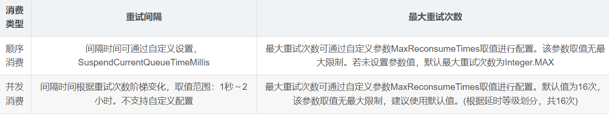
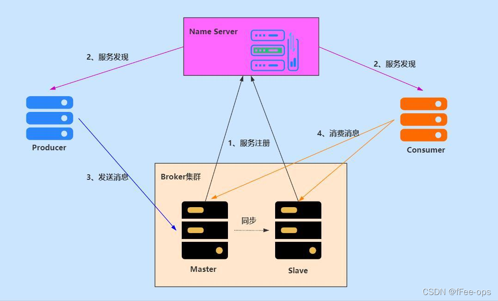
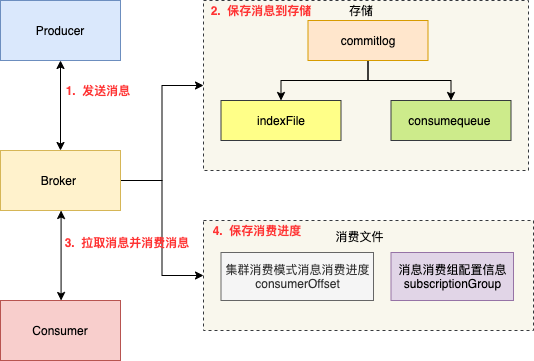
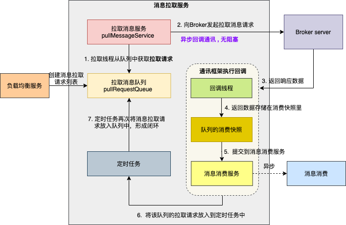
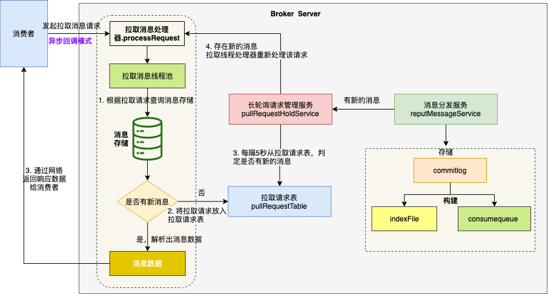
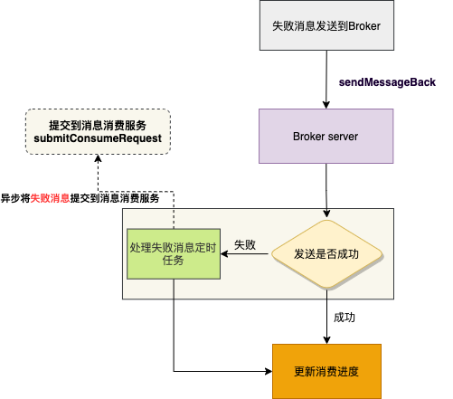
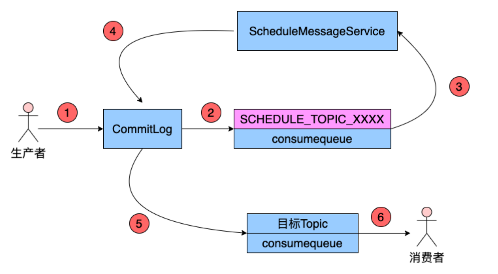
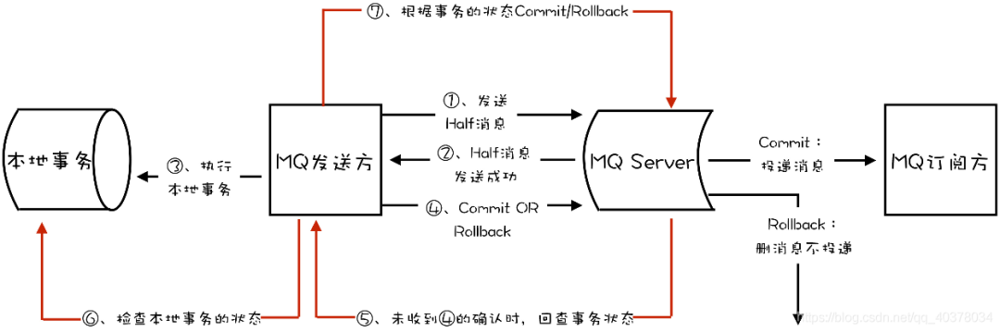

# RocketMQ的概念
① 支持事务型消息（即消息发送和DB操作保持两方的最终一致性，RabbitMQ和Kafka不支持）  
② 支持指定次数和时间间隔的失败消息重发  
③ 支持 Consumer 端 Tag 过滤，减少不必要的网络传输（即过滤由MQ完成，而不是由消费者完成。RabbitMQ 和 Kafka 不支持）  
④ 支持重复消费（RabbitMQ 不支持，Kafka 支持）

### 重试时间间隔与最大重试次数


### 各角色交互图


### NameServer的作用
① 路由注册  
Broker维护了与NameServer间的长连接，会将最新的信息以心跳包的方式上报给NameServer，每30秒发送一次心跳。心跳包中包含有BrokerId、Broker地址、
Broker名称、Broker所属集群名称等。NameServer在接收到心跳包后，会更新心跳时间戳，记录这个Broker的最新存活时间  

② 路由剔除  
由于Broker关机、宕机或网络抖动等原因，NameServer没有收到Broker的心跳，NameServer可能会将其从Broker列表中剔除  
NameServer中有一个定时任务，每隔10秒就会扫描一次Broker表，查看每一个Broker的最新心跳时间戳距离当前时间是否超过120秒，如果超过，
则会判定Broker失效，然后将其从Broker列表中剔除。Broker的日常运维工作，需要先将Broker的读写权限禁用，这时client（Consumer或Producer）
向Broker发送请求，都会收到Broker的NO_PERMISSION响应，然后client会进行对其它Broker的重试。当观察到这个Broker没有流量后，再关闭它  

③ 路由发现  
RocketMQ的路由发现采用的是Pull模型。当Topic路由信息出现变化时，NameServer不会主动推送给客户端，而是客户端定时拉取主题最新的路由。
默认客户端每30秒会拉取一次最新的路由  

④ 客户端NameServer的选择策略（指的是Producer或Consumer）  
首先采用的是随机策略进行的选择（客户端首先会生产一个随机数，然后再与NameServer节点数量取模），失败后采用的是轮询策略

> 扩展：zk Client是如何选择Zookeeper的？  
> 经过两次shuffle，然后选择第一台zk Server。实际上就是将配置文件中的zk server地址进行第一次shuffle，然后随机选择一个。
> 这个选择出的一般都是一个hostname，然后获取到该hostname对应的所有ip，再对这些ip进行第二次shuffle，从shuffle过的结果中取第一个server
> 地址进行连接

### Broker
① 启动NameServer，NameServer启动后开始监听端口，等待Broker、Producer、Consumer连接  
② 启动Broker时，Broker会与所有的NameServer建立并保持长连接，然后每30秒向NameServer定时发送心跳包  
③ 发送消息前，可以先创建Topic，创建Topic时需要指定该Topic要存储在哪些Broker上，当然，在创建Topic时也会将Topic与Broker的关系写入到NameServer中。
不过，这步是可选的，也可以在发送消息时自动创建Topic  
④ Producer发送消息，启动时先跟NameServer集群中的其中一台建立长连接，并从NameServer中获取路由信息，即当前发送Topic消息的Queue与Broker的地址
的映射关系。然后根据算法策略从队列中选择一个Queue，与队列所在的Broker建立长连接从而向Broker发消息。当然，在获取到路由信息后，
Producer会首先将路由信息缓存到本地，再每30秒从NameServer更新一次路由信息  
⑤ Consumer跟Producer类似，跟其中一台NameSever建立长连接，获取其所订阅Topic的路由信息，然后根据算法策略从路由信息中获取到其所要消费的Queue，
然后直接跟Broker建立长连接，开始消费其中的消息。Consumer在获取到路由信息后，同样也会每30秒从NameServer更新一次路由信息。不过不同于Producer的是，
Consumer还会向Broker发送心跳，以确保Broker的存活状态

### Topic
手动创建Topic时，有两种模式：  
① 集群模式：该模式下创建的Topic在该集群中，所有Broker中的Queue数量是相同的  
② Broker模式：该模式下创建的Topic在该集群中，每个Broker中的Queue数量可以不同  
自动创建Topic时，默认采用的是Broker模式，会为每个Broker默认创建4个Queue  

### Queue
从物理上讲，读/写队列是同一个队列。所以，不存在读/写队列数据同步的问题。读/写队列是逻辑上进行区分的概念。一般情况下，读/写队列数量是相同的  
例如，创建Topic时设置的写队列数量为8，读队列数量为4，此时系统会创建8个Queue，分别是0-7。Producer会将消息写入到这8个队列，但Consumer只会
消费0-3这4个队列中的消息，4-7中的消息是不会被消费到的

> 当读写队列数量不同时，总是有问题的，这样设计的目的是为了方便Topic的Queue的缩容  
> 例如原来创建的Topic中包含16个Queue，如何能够使其Queue缩容为8个，还不会丢失消息？可以动态修改写队列数量为8，读队列数量不变。
> 此时新的消息只能写入到前8个队列，而消费的却是16个队列中的数据。当发现后8个Queue中的消息消费完毕后，就可以再将读队列数量动态设置为8，
> 整个缩容的过程，没有任何消息丢失

### Queue分配算法
两种平均分配策略的分配效率较高，一致性hash策略的较低。因为一致性hash算法较复杂。另外，一致性hash策略分配的结果也很大可能上存在不平均的情况  
一致性hash算法的好处是可以有效减少由于消费组扩容或缩容所带来的大量的```Rebalance```

### 高可用保障
① NameServer高可用  
Broker 在启动时向所有 NameServer 注册（主要是服务器地址等） ，生产者在发送消息之前先从NameServer 获取 Broker 服务器地址列表（消费者一样），
然后根据负载均衡算法从列表中选择一台服务器进行消息发送。NameServer 与每台 Broker 服务保持长连接，并间隔 30S 检查 Broker 是否存活，
如果检测到Broker 宕机，则从路由注册表中将其移除，这样就可以实现 RocketMQ 的高可用  

② Broker高可用  
每个Broker与Name Server集群中的所有节点建立长连接，定时(每隔30s)注册Topic信息到所有Name Server。Name Server定时(每隔10s)扫描所有
存活broker的连接，如果Name Server超过2分钟没有收到心跳，则Name Server断开与Broker的连接  

③ 生产者高可用  
Producer与NameServer集群中的其中一个节点（随机选择）建立长连接，定期从NameServer取Topic路由信息，并向提供Topic服务的Master建立长连接，
且定时向Master发送心跳。Producer完全无状态，可集群部署  
Producer每隔30s（由ClientConfig的pollNameServerInterval）从Name server获取所有topic队列的最新情况，这意味着如果Broker不可用，
Producer最多30s能够感知，在此期间内发往Broker的所有消息都会失败  
Producer每隔30s（由ClientConfig中heartbeatBrokerInterval决定）向所有关联的broker发送心跳，Broker每隔10s中扫描所有存活的连接，
如果Broker在2分钟内没有收到心跳数据，则关闭与Producer的连接  

④ 消费者高可用  
Consumer与Name Server集群中的其中一个节点(随机选择)建立长连接，定期从Name Server取Topic路由信息，并向提供Topic服务的Master、Slave建立长连接，
且定时向Master、Slave发送心跳。Consumer既可以从Master订阅消息，也可以从Slave订阅消息，订阅规则由Broker配置决定  
Consumer每隔30s从Name server获取topic的最新队列情况，这意味着Broker不可用时，Consumer最多最需要30s才能感知  
Consumer每隔30s（由ClientConfig中heartbeatBrokerInterval决定）向所有关联的broker发送心跳，Broker每隔10s扫描所有存活的连接，
若某个连接2分钟内没有发送心跳数据，则关闭连接；并向该Consumer Group的所有Consumer发出通知，Group内的Consumer重新分配队列，然后继续消费  
当Consumer得到master宕机通知后，转向slave消费，slave不能保证master的消息100%都同步过来了，因此会有少量的消息丢失。但是一旦master恢复，
未同步过去的消息会被最终消费掉

### 数据复制与刷盘策略
##### 复制策略
复制策略是Broker的Master与Slave间的数据同步方式，分为同步复制与异步复制  
同步复制：消息写入master后，master会等待slave同步数据成功后才向producer返回成功ACK  
异步复制：消息写入master后，master立即向producer返回成功ACK，无需等待slave同步数据成功

> 异步复制策略会降低系统的写入延迟，RT变小，提高了系统的吞吐量

##### 刷盘策略
刷盘策略指的是broker中消息的落盘方式，即消息发送到broker内存后消息持久化到磁盘的方式。分为同步刷盘与异步刷盘：  
同步刷盘：当消息持久化到broker的磁盘后才算是消息写入成功  
异步刷盘：当消息写入到broker的内存后即表示消息写入成功，无需等待消息持久化到磁盘

> 1）异步刷盘策略会降低系统的写入延迟，RT变小，提高了系统的吞吐量  
> 2）消息写入到Broker的内存，一般是写入到了PageCache  
> 3）对于异步刷盘策略，消息会写入到PageCache后立即返回成功ACK。但并不会立即做落盘操作，而是当PageCache到达一定量时会自动进行落盘

### Broker集群模式最佳实践
一般会为Master配置RAID10磁盘阵列，然后再为其配置一个Slave。既利用了RAID10磁盘阵列的高效、安全性，又解决了可能会影响订阅的问题  
> 多master+RAID阵列，与多master多slave集群的区别是什么？  
> ① 多master，其仅仅可以保证数据不丢失，即不影响消息写入，但其可能会影响到消息的订阅。其执行效率要远高于多master多slave集群  
> ② 多master多slave集群，其不仅可以保证数据不丢失，即不会影响消息写入。但是运行效率要低于多master

# 消息的生产
① Producer发送消息之前，会先向NameServer发出获取```消息Topic的路由信息```的请求  
② NameServer返回该Topic的```路由表```及```Broker列表```  
③ Producer根据代码中指定的Queue选择策略，从Queue列表中选出一个队列，用于后续存储消息  
④ Producer对消息做一些特殊处理，例如消息本身超过4M，则会对其进行压缩  
⑤ Producer向选择出的Queue所在的Broker发出RPC请求，将消息发送到选择出的Queue
> 路由表：实际是一个Map，key为Topic名称，value是一个QueueData实例列表。QueueData并不是一个Queue对应一个QueueData，而是一个Broker中该
> Topic的所有Queue对应一个QueueData。即只要涉及到该Topic的Broker，一个Broker对应一个QueueData。QueueData中包含brokerName。简单来说，
> 路由表的key为Topic名称，value则为所有涉及该Topic的BrokerName列表。  
> Broker列表：也是一个Map，key为brokerName，value为BrokerData。一组brokerName名称相同的master-slave集群对应一个BrokerData。BrokerData中
> 包含brokerName及一个map。该map的key为brokerId，value为该broker对应的地址。brokerId为0表示该broker为master，非0表示slave

# 消息的存储
> abort：该文件在Broker启动后会自动创建，正常关闭Broker，该文件会自动消失。若在没有启动Broker的情况下，发现这个文件是存在的，则说明之前Broker
> 的关闭是非正常关闭  
> checkpoint：其中存储着```commitlog```、```consumequeue```、```index```文件的最后刷盘时间戳  
> ```commitlog```：其中存放着```commitlog```文件，而消息是写在```commitlog```文件中的  
> config：存放着Broker运行期间的一些配置数据  
> ```consumequeue```：其中存放着```consumequeue```文件，队列就存放在这个目录中  
> index：其中存放着消息索引文件indexFile  
> lock：运行期间使用到的全局资源锁

### 消息写入

### 消息拉取

### 性能提升

# 消息的消费
```
https://mp.weixin.qq.com/s/DyvQEqRmS9typocu6B7DGw
```

### 消费组
实现了负载均衡和容错  
负载均衡：将一个Topic中的不同的Queue平均分配给同一个ConsumerGroup的不同的Consumer  
容错：一个Consumer挂了，该ConsumerGroup中的其它Consumer可以接着消费原Consumer消费的Queue

> 消费者数量和队列数量的关系  
> ① 如果消费者consumer机器数量和消息队列相等，则消息队列平均分配到每一个consumer上  
> ② 如果consumer数量大于消息队列数量，则超出消息队列数量的机器没有可以处理的消息队列  
> ③ 若消息队列数量不是consumer的整数倍，则部分consumer会承担跟多的消息队列的消费任务  
> 在扩容consumer实例数量的同时，必须同步扩容主题中的分区数量，确保consumer的实例数和分区数量是相等的  
> 如果consumer的实例数量超过分区数量，这样的扩容实际上是没有效果的。因为对于消费者来说，在每个分区上实际上只能支持单线程消费

### 消息顺序
顺序消费表示消息消费的顺序和生产者为每个消息队列发送信息时候的顺序一致，所以如果正在处理全局顺序是强制性的场景，需要确保使用的主题只有一个消息队列  
并行消费不再保证消息顺序，消费的最大并行数量受每个消费者客户端指定的线程池限制

### 消息标识
① msgId：由producer端生成，其生成规则为：producerIp + 进程pid + MessageClientIDSetter类的ClassLoader的hashCode + 当前时间 + ```AutomicInteger```自增计数器  
② offsetMsgId：由broke端生成，其生成规则为：brokerIp + 物理分区的offset（Queue中的偏移量）  
③ key：由用户指定的业务相关的唯一标识

### 过滤消息

### 消费端负载均衡
消费端的负载均衡是指将Broker端中多个队列按照某种算法分配给同一个消费组中的不同消费者，负载均衡是客户端开始消费的起点  
① 消费队列在同一时间只允许被同一消费组内的一个消费者消费  
② 一个消费者能同时消费多个消息队列
```
负载均衡触发了拉取消息的流程
```
① 消费端启动时，立即进行负载均衡  
② 消费端定时任务每隔20秒触发负载均衡  
③ 消费者上下线，Broker端通知消费者触发负载均衡  

消费者启动后，它就会通过定时任务不断地向RocketMQ集群中的所有Broker实例发送心跳包。负载均衡服务会根据消费模式为”广播模式“还是”集群模式“做不同的逻辑处理  
这里主要来看下集群模式下的主要处理流程：  
① 获取该主题下的消息消费队列集合  
② 查询Broker端获取该消费组下消费者id列表  
③ 先对Topic下的消息消费队列、消费者id排序，然后用消息队列分配策略算法（默认为消息队列的平均分配算法），计算出待拉取的消息队列，然后创建
拉取消息请求列表，并将请求分发到消息拉取服务，进入消息拉取环节

### RocketMQ如何保证集群消费模式

① 发送消息：生产者发送消息到Broker  
② 保存消息：Broker将消息存储到commitLog文件，异步线程会构建消费文件consumerQueue  
③ 消费流程：消费者启动后，会通过负载均衡分配对应的队列，然后向Broker发送拉取消息请求。Broker收到消费者拉取请求之后，根据订阅组，消费者编号，
主题，队列名，逻辑偏移量等参数，从该主题下的consumerQueue文件查询消息消费条目，然后从commitLog文件中获取消息实体。消费者在收到消息数据之后，
执行消费监听器，消费完消息  
④ 保存进度：消费者将消费进度提交到Broker，Broker会将该消费组的消费进度存储在进度文件里

### 消费具体实现逻辑




### 重试机制
消息消费失败后，消费者实例会通过```consumer_send_msg_back```请求，将失败消息发回到Broker端  
Broker端会为每个topic创建一个重试队列，队列名称是```%RETRY` + 消费者组名```，达到重试时间后将消息投递到重试队列中进行消费重试（消费者组会
自动订阅重试topic）。最多重试消费16次，重试的时间间隔逐渐变长，若达到最大重试次数后消息还没有成功被消费，则消息将被投递至死信队列  

### ```Rebalance```机制
```Rebalance```机制的本意是为了提升消息的并行消费能力。由于一个队列最多分配一个消费者，因此当某个消费组下的消费者实例数量大于队列的数量时，
多余的消费者实例将分配不到任何队列。消费者所订阅Topic的Queue数量发生变化，或消费组中消费者的数量发生变化都会导致```Rebalance```的产生  
Consumer实例在接收到通知后会采用```Queue分配算法```自己获取到相应的Queue，即由Consumer实例自主进行```Rebalance```

> ```Rebalance```的危害  
> ① 消费暂停：```Rebalance```发生后，原Consumer就需要暂停部分队列的消费，等到这些队列分配给新的Consumer后，这些暂停消费的队列才能继续被消费  
> ② 消费重复：Consumer在消费分配给自己的队列时，必须接着之前Consumer提交的消费进度的offset继续消费。然而默认情况下，offset是异步提交的，
> 这个异步性导致提交到Broker的offset与Consumer实际消费的消息并不一致，这个不一致就是可能会重复消费的消息

# 消费幂等
### 产生重复消息的场景
① 当一条消息被成功发送到Broker并完成持久化，此时出现了网络闪断，从而导致Broker对Producer应答失败。如果此时Producer意识到消息发送失败并尝试
再次发送消息，此时Broker中就可能会出现两条内容相同并且Message ID也相同的消息，那么后续Consumer就一定会消费两次该消息  

② 消费已投递到Consumer并完成业务处理，当Consumer给Broker反馈应答时网络闪断，Broker没有接收到消费成功响应，为了保证消息至少被消费一次的原则，
Broker将在网络恢复后再次尝试投递之前已被处理过的消息。此时消费者就会收到与之前处理过的内容相同、Message ID也相同的消息  

③ ```Rebalance```时消息重复  
当Consumer Group中的Consumer数量发生变化时，或其订阅的Topic的Queue数量发生变化时，会触发```Rebalance```，此时Consumer可能会收到
曾经被消费过的消息

# 消息堆积与消费延迟
消息堆积的主要瓶颈在于客户端的消费能力，而消费能力由```消费耗时```和```消费并发度```决定，注意，消费耗时的优先级要高于消费并发度，即在保证了消费耗时的合理性前提下，
再考虑消费并发度的问题

### 消费耗时
CPU内部计算型代码和外部IO操作型代码都是影响处理时长代码的主要两种类型。但是如果代码中没有复杂的递归和循环的话，内部计算耗时相对外部IO操作来说
几乎可以忽略，所以外部IO型代码是影响消息处理时长的主要症结所在
> 外部IO操作型代码：  
> ① 读写外部数据库  
> ② 读写外部缓存系统  
> ③ 下游系统调用，例如```Dubbo```的RPC远程调用，Spring Cloud的对下游系统的Http接口调用

> 对于下游系统调用逻辑需要进行提前梳理，掌握每个调用操作预期的耗时，这样做是为了能够判断消费逻辑中IO操作的耗时是否合理。  
> 通常消息堆积是由于下游系统出现了服务异常或达到了DBMS容量限制，导致消费耗时增加

# 消息的清理
消息是被顺序存储在```commitlog```文件的，且消息大小不定长，所以消息的清理是不可能以消息为单位进行清理的，而是以```commitlog```文件为单位进行清理的。否则会急剧下降清理效率，并实现逻辑复杂。  
```commitlog```文件存在一个过期时间，默认为72小时，即三天。除了用户手动清理外，在以下情况下也会被自动清理，无论文件中的消息是否被消费过：  
① 文件过期，且到达清理时间点（默认为凌晨4点）后，自动清理过期文件  
② 文件过期，且磁盘空间占用率已达过期清理警戒线（默认75%）后，无论是否达到清理时间点，都会自动清理过期文件  
③ 磁盘占用率达到清理警戒线（默认85%）后，开始按照设定好的规则清理文件，无论是否过期。默认会从最老的文件开始清理  
④ 磁盘占用率达到系统危险警戒线（默认90%）后，Broker将拒绝消息写入

> 对于RocketMQ系统来说，删除一个1G大小的文件，是一个压力巨大的IO操作。在删除过程中，系统性能会骤然下降。所以，其默认清理时间点为凌晨4点，
> 访问量最小的时间。也正因如果，我们要保障磁盘空间的空闲率，不要使系统出现在其它时间点删除```commitlog```文件的情况。  
> 
> 官方建议RocketMQ服务的Linux文件系统采用ext4。因为对于文件删除操作，ext4要比ext3性能更好

# RocketMQ的应用
## 普通消息
① 同步发送消息  
② 异步发送消息  
③ 单向发送消息

## 顺序消息
Queue选择器的作用及实现

## 延迟消息


## 事务消息

## 批量发送消息

## 消息过滤

### 死信队列


### 消息发送重试机制

### 消息消费重试机制
① 顺序消息消费失败后，为了保证消息的顺序性，会自动不断地进行消息重试，直到消费成功。消费重试默认间隔时间为1000ms。重试期间应用会出现消息消费被阻塞的情况  
```
// 顺序消息消费失败的重试时间间隔为1000ms，取值范围为[10,30000]
consumer.setSuspendCurrentQueueTimeMillis(100);
```

② 对于无序消息（普通消息、延时消息、事务消息），可以通过设置返回状态达到消息重试的效果。无序消息重试只对集群消费方式生效。  

> 以下三种方式都是希望消费重试：  
> ① 返回 ConsumeConcurrentlyStatus.RECONSUME_LATER (推荐)  
> ② 返回null  
> ③ 抛出异常
> 若返回 ConsumeConcurrentlyStatus.CONSUME_SUCCESS，则不进行消费重试

无序消息在集群下的重试消费，每条消息最多重试16次，每次重试间隔时间是不同的，会逐渐变长

# 使用RocketMQ事务消息实现分布式事务的流程图


# 一致性思路
通过事务消息仅仅是保证了```本地事务```和```MQ消息发送```形成整体的```原子性```，而投递到MQ服务器后，并无法保证消费者一定能消费成功  
保证消费端也实现数据一致性的思路  
① 消费失败后进行一定次数的```重试```  
② 重试后也失败的话将消息丢进```死信队列```中  
③ 起一个线程监听消费```死信队列```里的消息，记录日志并且预警

