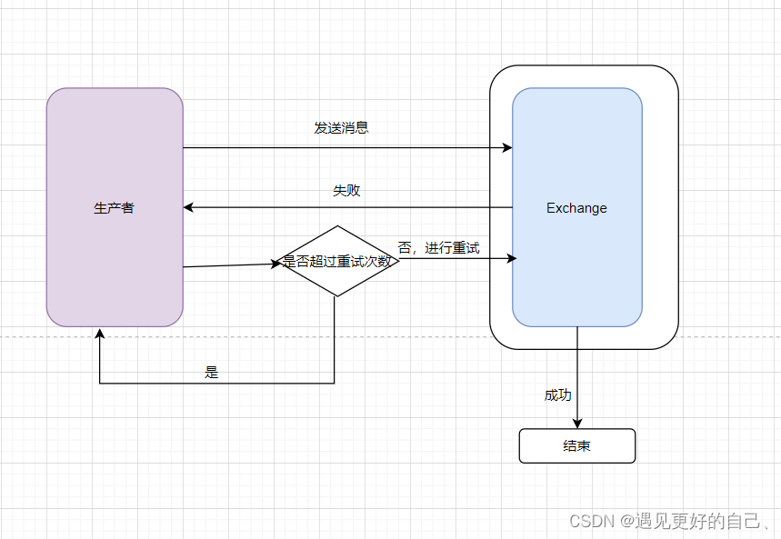
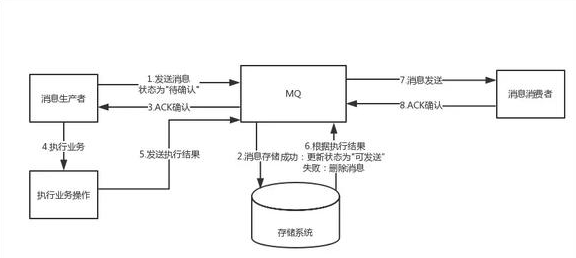

# 消息防丢失方案
① 生产者开启confirm确认机制  
② MQ消息默认设置为持久化，为所有队列设置镜像队列  
③ 消费者默认设置手动确认autoAck=false，并设置死信队列

# 消息防堆积方案
事前压测，事中扩容，事后如下方案：  
① 提高消费并行度，可以增加更多消费者同时来处理  
② 批量方式消费，处理消息时批量处理  
③ 跳过非重要消费  
④ 优化每条消息的消费过程

# 消息发送失败处理方案
### 消息找不到队列导致消息发送失败
设置```mandatory=true```，交换机无法根据自身的类型和路由键找到一个符合条件的队列的话，那么RabbitMQ会调用```basic.Return```命令将消息返回给生产者  
这时候可以通过调用```channel.addReturnListener()```来添加returnListener监听器实现，将错误消息记录日志，并发送预警信息  
```java
channel.basicPublish(EXCHANGE_NAME,"",true,MessageProperties.PERSISTENT_TEXT_PLAIN,"消息内容".getBytes());

channel.addReturnListener(
        new ReturnListener() {
            public void handlerReturn(int replyCode,String replyText,String exchange,String routingKey,AMQP.BasicProperties basicProperties,byte[] body){
                String content = new String(body);    
                System.out.println("Basic.Return返回的结果是：" + content);
            }
        }
)
```

### 生产者客户端发送出去之后可能发生网络丢包、网络故障等造成消息丢失
生产者将信道设置成confirm模式。一旦信道进入confirm模式，所有在该信道上面发布的消息都会被指派一个唯一的id，一旦消息被投递到所有匹配的队列之后，RabbitMQ就会发送一个确认(Basic.ACK)
给生产者（包含消息的唯一id），这就使得生产者知晓消息已经正确到达目的地了。RabbitMQ回传给生产者的确认消息中的deliveryTag包含了确认消息的序号，此外RabbitMQ也可以设置
channel.basicACK()中的multiple参数，表示这个序号之前的所有消息都已经得到了处理  

客户端实现生产者confirm有三种方式  
① 普通confirm模式：每发送一条消息后，调用waitForConfirms()方法，等待服务器端confirm。实际上是一种串行的confirm了  
② 批量confirm模式：每发送一条消息后，调用waitForConfirms()方法，等待服务器端confirm  
③ 异步confirm模式：提供一个回调方法，服务端confirm了一条或者多条消息后client端会回调这个方法

# 消息发送失败补偿方案

当消息发送失败后，结合MQ配置，对消息进行重试并记录error日志，达到重试次数后，将处理结果通过回调接口的方式告诉生产者，生产者去进行额外的补偿机制

# 消息消费失败处理方案
① 设置死信队列  
当消息发送失败后，设置requeue=false消息进入死信队列，并获取死信队列的长度，设置重新发送到正常队列的重试时间和重试间隔，重新发送到正常队列。  

② 将消息存入本地客户端，进行重发  
将消费失败的消息，存入redis或者持久化到消费端的数据库表  

总结：死信队列能很好 的处理消息消费失败的场景，使用MQ原生的支持，避免过重的设计，使用方案一即可

### 死信队列补偿机制

说明：当消息消费失败后，进入死信队列，运维同事监控死信队列，及时预警。当评估不是因为数据的原因导致消费失败，运维同事在管理平台手动将消息迁移到正常队列  
> 获取死信队列的长度，当大于0时并判断是否超过重试次数并达到重试间隔，当没有超过重试次数时，可以自动将消息从死信队列迁移到正常队列

# 事务消息
由于传统的处理方式无法解决消息生产者本地事务处理成功与消息发送成功两者的一致性，因此事务消息就诞生了，它实现了消息生成者本地事务与消息发送的原子性，保证了消息生成者本地事务处理成功与消息发送成功的最终一致性问题


注意点：由于MQ通常都会保证消息能够投递成功，因此，如果业务没有及时返回ACK结果，那么就有可能造成MQ的重复消息投递问题。因此，对于消息最终一致性的方案，消息的消费组必须要对消息的消费
支持幂等，不能造成同一条消息的重复消费的情况

### 事务消息的异常情况分析
##### 如果预发送消息失败，是不是业务就不执行了？
对于基于消息最终一致性的方案，一般都会强依赖这步，如果这个步骤无法得到保证，那么也就不可能做到最终一致性了

##### 为什么要增加一个预发送机制，增加两次发布出去消息的重试机制，为什么不在业务成功之后，发送失败的话使用一次重试机制？
如果业务执行成功，再去发消息，此时如果还没来得及发消息，业务系统就已经宕机了，系统重启后，根本没有记录之前是否发送过消息，这样就会导致业务执行成功，消息最终没发出去的情况

##### 如果consumer消费失败，是否需要producer做回滚了？
这里的事务消息，producer并不会因为consumer消费失败而做回滚，采用事务消息的应用，其所追求的高可用和最终一致性，消息消费失败的话，MQ自己会负责重推消息，直到消费成功。因此，
事务消息是针对生产端而言的。对于消费端，消费端的一致性是通过MQ的重试机制来完成的

##### 如果consumer端因为业务异常而导致回滚，那么岂不是两边最终无法保证一致性？
基于消息的最终一致性方案必须保证消费端在业务上的操作没障碍，它只允许系统异常的失败，不允许业务上的失败，比如你在业务上跑出个NPE之类的问题，导致你消费端执行事务失败，那么就很难做到一致了
