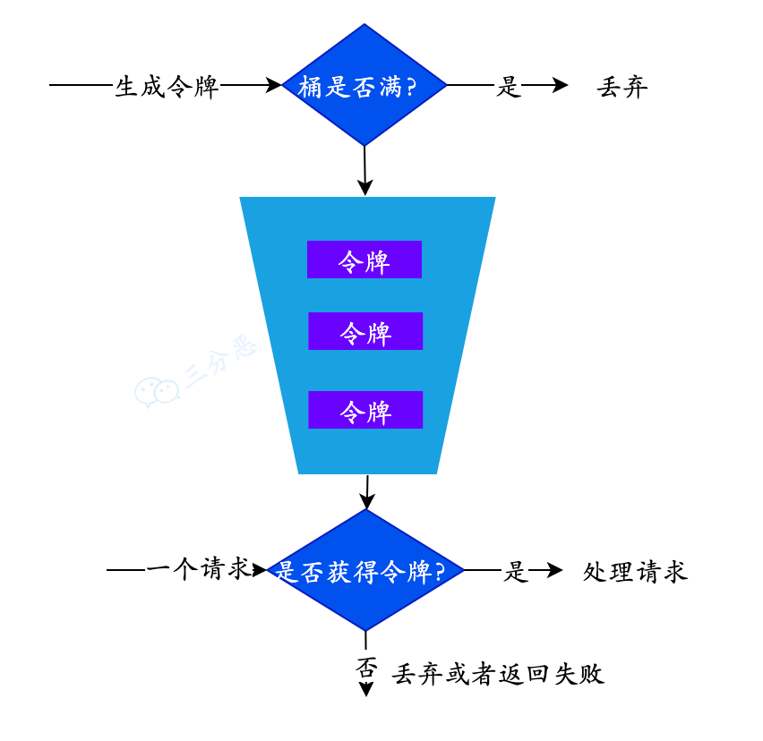

# 固定窗口限流算法

# 滑动窗口限流算法

# 漏桶算法

# 令牌桶算法
[redis+lua脚本+令牌桶算法 实现限流控制](https://blog.csdn.net/bortherLiang/article/details/109189176)  


① 有一个令牌管理员，根据限流大小，定速往令牌桶里放令牌  
② 如果令牌数量满了，超过令牌桶容量的限制，那就丢弃  
③ 系统在接受到一个用户请求时，都会先去令牌桶要一个令牌，如果拿到令牌，那么就处理这个请求的业务逻辑  
④ 如果拿不到令牌，就直接拒绝这个请求  

一、自定义注解，用来给限流的方法标注
```java
@Target({ElementType.TYPE, ElementType.METHOD})
@Retention(RetentionPolicy.RUNTIME)
public @interface RateLimit {
    //限流唯一标示
    String key() default "";

    //限流单位时间（单位为s）
    int time() default 1;

    //单位时间内限制的访问次数
    int count();

    //是否限制ip
    boolean ipLimit() default false;
}
```

二、编写lua脚本  
```
根据key（参数） 查询 对应的 value（令牌数）
	如果为null 说明该key 是第一次进入 
	{
		初始化 令牌桶（参数）数量;记录初始化时间 ->返回 剩余令牌数
	} 
	
	如果不为null
	{
		判断 value 是否大于1 
		{
			大于1  ->value - 1  -> 返回 剩余令牌数
			小于1  -> 判断  补充令牌时间间隔是否足够
			{
				足够 -> 补充令牌；更新补充令牌时间-> 返回 剩余令牌数
				不足够	-> 返回 -1 (说明超过限流访问次数)
			}
		}
	}
```

```
redis.replicate_commands();
-- 参数中传递的key
local key = KEYS[1]
-- 令牌桶填充 最小时间间隔
local update_len = tonumber(ARGV[1])
-- 记录 当前key上次更新令牌桶的时间的 key
local key_time = 'ratetokenprefix'..key
-- 获取当前时间(这里的curr_time_arr 中第一个是 秒数，第二个是 秒数后毫秒数)，由于我是按秒计算的，这里只要curr_time_arr[1](注意：redis数组下标是从1开始的)
--如果需要获得毫秒数 则为 tonumber(arr[1]*1000 + arr[2])
local curr_time_arr = redis.call('TIME')
-- 当前时间秒数
local nowTime = tonumber(curr_time_arr[1])
-- 从redis中获取当前key 对应的上次更新令牌桶的key 对应的value
local curr_key_time = tonumber(redis.call('get',KEYS[1]) or 0)
-- 获取当前key对应令牌桶中的令牌数
local token_count = tonumber(redis.call('get',KEYS[1]) or -1)
-- 当前令牌桶的容量
local token_size = tonumber(ARGV[2])
-- 令牌桶数量小于0 说明令牌桶没有初始化
if token_count < 0 then
	redis.call('set',key_time,nowTime)
	redis.call('set',key,token_size -1)
	return token_size -1
else
	if token_count > 0 then --当前令牌桶中令牌数够用
		redis.call('set',key,token_count - 1)
		return token_count -1   --返回剩余令牌数
	else    --当前令牌桶中令牌数已清空
		if curr_key_time + update_len < nowTime then    --判断一下，当前时间秒数 与上次更新时间秒数  的间隔，是否大于规定时间间隔数 （update_len）
			redis.call('set',key,token_size -1)
			return token_size - 1
		else
			return -1
		end
	end
end
```

三、读取lua脚本
```java
@Component
public class CommonConfig {
    /**
     * 读取限流脚本
     */
    @Bean
    public DefaultRedisScript<Number> redisLuaScript() {
        DefaultRedisScript<Number> redisScript = new DefaultRedisScript<>();
        //这里脚本的路径为path for source root 路径
        redisScript.setScriptSource(new ResourceScriptSource(new ClassPathResource("myLua.lua"))); 
        redisScript.setResultType(Number.class);
        return redisScript;
    }
    /**
     * RedisTemplate
     */
    @Bean
    public RedisTemplate<String, Serializable> limitRedisTemplate(LettuceConnectionFactory redisConnectionFactory) {
        RedisTemplate<String, Serializable> template = new RedisTemplate<String, Serializable>();
        template.setKeySerializer(new StringRedisSerializer());
        template.setValueSerializer(new GenericJackson2JsonRedisSerializer());
        template.setConnectionFactory(redisConnectionFactory);
        return template;
    }
}
```

四、创建拦截器拦截带有该注解的方法
```java
@Component
public class RateLimitInterceptor implements HandlerInterceptor {
    private final Logger LOG = LoggerFactory.getLogger(this.getClass());
    
    @Autowired
    private RedisTemplate<String, Serializable> limitRedisTemplate;

    @Autowired
    private DefaultRedisScript<Number> redisLuaScript;
    
    @Override
    public boolean preHandle(HttpServletRequest request, HttpServletResponse response, Object handler) throws Exception {
        assert handler instanceof HandlerMethod;
        HandlerMethod method = (HandlerMethod) handler;
        RateLimit rateLimit = method.getMethodAnnotation(RateLimit.class);
        //当前方法上有我们自定义的注解
        if (rateLimit != null) {
            //获得单位时间内限制的访问次数
            int count = rateLimit.count();
            String key = rateLimit.key();
            //获得限流单位时间（单位为s）
            int time = rateLimit.time();
            boolean ipLimit = rateLimit.ipLimit();
            //拼接 redis中的key
            StringBuilder sb = new StringBuilder();
            sb.append(Constants.RATE_LIMIT_KEY).append(key).append(":");
            //如果需要限制ip的话
            if(ipLimit){
                sb.append(getIpAddress(request)).append(":");
            }
            List<String> keys = Collections.singletonList(sb.toString());
           //执行lua脚本
            Number execute = limitRedisTemplate.execute(redisLuaScript, keys, time, count);
            assert execute != null;
            if (-1 == execute.intValue()) {
                ResultModel resultModel = ResultModel.error_900("接口调用超过限流次数");
                response.setStatus(901);
                response.setCharacterEncoding("utf-8");
                response.setContentType("application/json");
                response.getWriter().write(JSONObject.toJSONString(resultModel));
                response.getWriter().flush();
                response.getWriter().close();
                LOG.info("当前接口调用超过时间段内限流,key:{}", sb.toString());
                return false;
            } else {
                LOG.info("当前访问时间段内剩余{}次访问次数", execute.toString());
            }
        }
        return true;
    }

    @Override
    public void postHandle(HttpServletRequest request, HttpServletResponse response, Object handler, ModelAndView modelAndView) throws Exception {

    }

    @Override
    public void afterCompletion(HttpServletRequest request, HttpServletResponse response, Object handler, Exception ex) throws Exception {

    }
    
    public static String getIpAddr(HttpServletRequest request) {
        String ipAddress = null;
        try {
            ipAddress = request.getHeader("x-forwarded-for");
            if (ipAddress == null || ipAddress.length() == 0 || "unknown".equalsIgnoreCase(ipAddress)) {
                ipAddress = request.getHeader("Proxy-Client-IP");
            }
            if (ipAddress == null || ipAddress.length() == 0 || "unknown".equalsIgnoreCase(ipAddress)) {
                ipAddress = request.getHeader("WL-Proxy-Client-IP");
            }
            if (ipAddress == null || ipAddress.length() == 0 || "unknown".equalsIgnoreCase(ipAddress)) {
                ipAddress = request.getRemoteAddr();
            }
            // 对于通过多个代理的情况，第一个IP为客户端真实IP,多个IP按照','分割
            // "***.***.***.***".length()
            if (ipAddress != null && ipAddress.length() > 15) { 
                // = 15
                if (ipAddress.indexOf(",") > 0) {
                    ipAddress = ipAddress.substring(0, ipAddress.indexOf(","));
                }
            }
        } catch (Exception e) {
            ipAddress = "";
        }
        return ipAddress;
    }
}
```

```java
public class Constants {
    public static final String RATE_LIMIT_KEY = "rateLimit:";
}
```

五、WebConfig中注册这个这个拦截器  

六、注解使用
```java
@RestController
@RequestMapping(value = "/test")
public class TestController {

    //限流规则为 1秒内只允许同一个ip发送5次请求
    @RateLimit(key = "testGet",time = 1,count = 5,ipLimit = true)
    @RequestMapping(value = "/get")
    public ResultModel testGet(){
        return ResultModel.ok_200();
    }
}
```