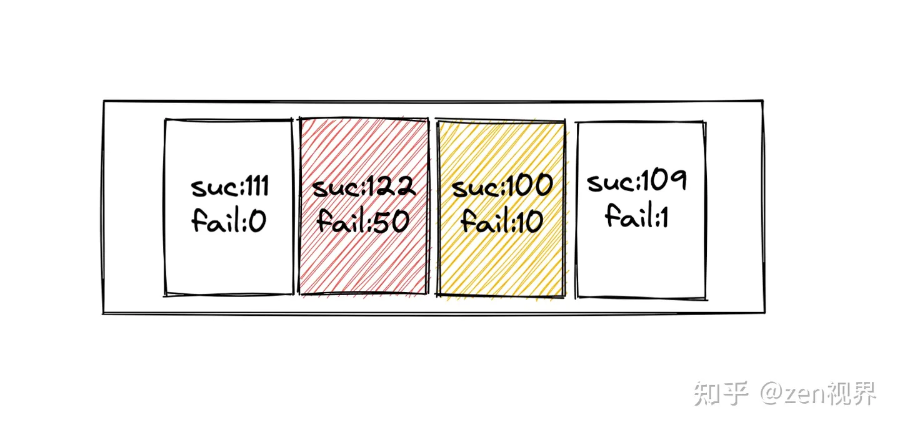

# 什么是业务补偿
当某个操作发生异常时，通过内部机制将这个异常产生的不一致状态消除掉

# 业务补偿设计的实现方式
### 回滚（事务补偿）
逆向操作，回滚业务流程，意味着放弃，当前操作必然会失败

### 回滚的实现方式
对于跨库的事务，比较常见 的解决方案有：两阶段提交、三阶段提交。但是这 两种 方式、在高可用的架构中一般都不可取，因为跨库锁表会消耗很大的性能  
高可用的架构中一般不会要求强一致性，只要达到最终的一致性就可以了。可以考虑：事务表、消息队列、补偿机制、TCC模式（占位/确认或取消）、
Sagas模式（拆分事务 + 补偿机制）来实现最终的一致性

### 重试
正向操作，努力地把一个业务流程执行完成，代表着还有成功的机会  
常见的重试主要有两种模式：原地重试、异步重试  
> 原地重试很好理解，就是程序在调用下游服务失败的时候重新发起一次  
> 异步重试是将请求信息丢到某个 mq 中，后续有一个程序消费到这个事件进行重试

### 重试策略
策略1：立即重试  
策略2：固定间隔  
策略3：增量间隔  
> 每一次的重试间隔时间增量递增。比如，第一次 0 秒、第二次 5 秒、第三次 10 秒这样，使得失败次数越多的重试请求优先级排到越后面，给新进入的重试请求让路

策略4：指数间隔  
> 每一次的重试间隔呈指数级增加。和增量间隔一样，都是想让失败次数越多的重试请求优先级排到越后面，只不过这个方案的增长幅度更大一些

策略5：全抖动  
> 在递增的基础上，增加随机性（可以把其中的指数增长部分替换成增量增长。）适用于将某一时刻集中产生的大量重试请求进行压力分散的场景

策略6：等抖动  
> 在「指数间隔」和「全抖动」之间寻求一个中庸的方案，降低随机性的作用。适用场景和「全抖动」一样


### 重试时的注意事项
对需要重试的接口，是需要做成```幂等性```的，不能因为服务的多次调用导致业务数据的累计增加和减少  
思路是给每个请求定一个唯一标识，在进行重试的时候判断这个请求是否已经被执行或者正在执行中，如果是则抛弃该请求

### 防止重试风暴
① 单实例限流
> 首先，我们接受请求的是单个实例（进程）中的线程，所以可以以单进程的粒度进行限流。  
> 关于限流，我们常用的是令牌桶或者滑动窗口两种实现，这里简单实用滑动窗口实现。如下图所示，每秒会产生一个Bucket，我们在Bucket里记录
> 这一秒内对下游某个接口的成功、失败数量。进而可以统计出每秒的失败率，结合失败率及失败请求数判断是否需要重试，每个 Bucket 在一定时间后过期。
> 如果下游大面积失败，这种时候是不适合重试的，我们可以配置一个比如失败率超过10%不重试的策略，这样在单机层面就可以避免很多不必要的重试。
> 

② 规范重试状态码  
链路层面防止重试的最好做法是只在最下游重试。约定一个特殊的业务状态码，它表示失败了，但是别重试。任何一个环节收到下游这个错误，不会重试，继续
透传给上游。通过这个模式，如果是数据库抖动情况下，只有最下游的三个重试请求，上游服务判断状态码知道不可重试不再重试，除此之外，在一些业务异常情况
下也可通过状态码区分出无需重试的状态

### 超时时重试优化（避免不必要的重试）
① 上游重试的请求不重试  
A->B->C时，A请求B超时重试，那么重试时会带上Flag，B发现A的请求中的Flag，如果这个时候请求C失败，那么也不再重试请求，这样就避免了重试被放大  

② 合理设置各个环节的超时时间  
A -> B -> C，B -> C 加上超时最多是 1s 时间，那么 A -> B 的超时时间要 >= 1秒，否则可能 B 对 C 的重试还没结束， A 就发起重试请求了。
这类问题，我们可以通过分析离线数据发现环节中存在的不合理配置

### 降低时延的重试
如果正常请求的超时时间是1s，那么当超时时间超过x ms（eg. 500ms）不等超时时间直接再发起一个相同 的请求，如果旧 的请求超时，
新 的请求正常落在300ms以内，那么我们这次请求不会超时且会在超时时间内完成。

### 重试机制的总结
① 微服务重试很重要，因为可以避免一些网络波动导致的请求失败，提升服务稳定性  
② 重试机制分为同步、异步两种模式，各有各的特性，需要结合业务选择  
③ 常见的重试算法有线性退避、指数退避、随机退避，以及结合其中两种的综合退避  
④ 重试风暴，在微服务中是一大隐患，我们可以通过单机重试限流以及约定重试状态码来规避  
⑤ 超时场景下的重试优化，上游因超时发起的流量，下游收到不再重复重试；合理配置链路超时时间  
⑥ 针对时延敏感业务，可使用 backup request 减轻长尾效应

# 业务补偿机制的注意事项
① 因为要把一个业务流程执行完成，需要这个流程中所涉及的服务方支持幂等性，并且在上游有重试机制  
② 我们需要小心维护和监控整个过程的状态，所以，千万不要把这些状态放到不同的组件中，最好是一个业务流程的控制方来做这个事，也就是一个工作流引擎，所以，这个工作流引擎是需要高可用和稳定的  
③ 补偿的业务逻辑和流程不一定非得是严格反向操作，有时候可以并行，有时候，可能会更简单。总之，设计业务正向流程的时候，也需要设计业务的反向补偿流程  
④ 我们要清楚 的知道，业务补偿的业务逻辑是 强业务相关的，很难做成通用的  
⑤ 下层的业务方最好提供短期的资源预留机制，就像电商中的把货品的库存预先占住等待用户在15分钟内支付，如果没有收到用户的支付，则释放内存，然后回滚到之前的下单操作，等待用户重新下单
