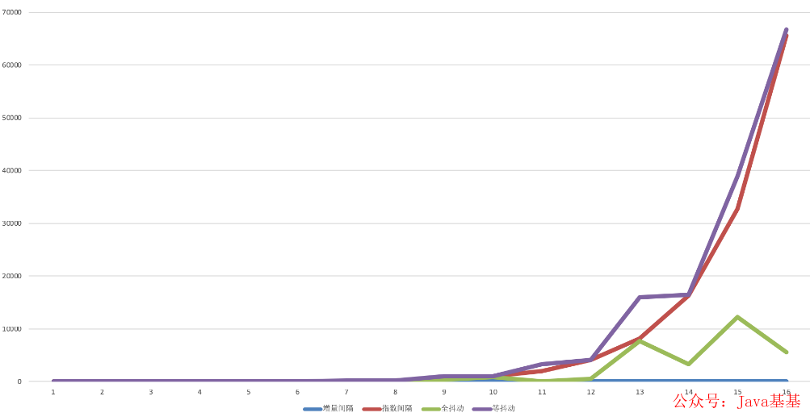

# 什么是业务补偿
当某个操作发生异常时，通过内部机制将这个异常产生的不一致状态消除掉

# 业务补偿设计的实现方式
### 回滚（事务补偿）
逆向操作，回滚业务流程，意味着放弃，当前操作必然会失败

### 回滚的实现方式
对于跨库的事务，比较常见 的解决方案有：两阶段提交、三阶段提交。但是这 两种 方式、在高可用的架构中一般都不可取，因为跨库锁表会消耗很大的性能  
高可用的架构中一般不会要求强一致性，只要达到最终的一致性就可以了。可以考虑：事务表、消息队列、补偿机制、TCC模式（占位/确认或取消）、
Sagas模式（拆分事务 + 补偿机制）来实现最终的一致性

### 重试
正向操作，努力地把一个业务流程执行完成，代表着还有成功的机会

### 重试策略
策略1：立即重试  
策略2：固定间隔  
策略3：增量间隔  
> 每一次的重试间隔时间增量递增。比如，第一次 0 秒、第二次 5 秒、第三次 10 秒这样，使得失败次数越多的重试请求优先级排到越后面，给新进入的重试请求让路

策略4：指数间隔  
> 每一次的重试间隔呈指数级增加。和增量间隔一样，都是想让失败次数越多的重试请求优先级排到越后面，只不过这个方案的增长幅度更大一些

策略5：全抖动  
> 在递增的基础上，增加随机性（可以把其中的指数增长部分替换成增量增长。）适用于将某一时刻集中产生的大量重试请求进行压力分散的场景

策略6：等抖动  
> 在「指数间隔」和「全抖动」之间寻求一个中庸的方案，降低随机性的作用。适用场景和「全抖动」一样

### 重试时的注意事项
对需要重试的接口，是需要做成幂等性的，不能因为服务的多次调用导致业务数据的累计增加和减少  
思路是给每个请求定一个唯一标识，在进行重试的时候判断这个请求是否已经被执行或者正在执行中，如果是则抛弃该请求

# 业务补偿机制的注意事项
① 因为要把一个业务流程执行完成，需要这个流程中所涉及的服务方支持幂等性，并且在上游有重试机制  
② 我们需要小心维护和监控整个过程的状态，所以，千万不要把这些状态放到不同的组件中，最好是一个业务流程的控制方来做这个事，也就是一个工作流引擎，所以，这个工作流引擎是需要高可用和稳定的  
③ 补偿的业务逻辑和流程不一定非得是严格反向操作，有时候可以并行，有时候，可能会更简单。总之，设计业务正向流程的时候，也需要设计业务的反向补偿流程  
④ 我们要清楚 的知道，业务补偿的业务逻辑是 强业务相关的，很难做成通用的  
⑤ 下层的业务方最好提供短期的资源预留机制，就像电商中的把货品的库存预先占住等待用户在15分钟内支付，如果没有收到用户的支付，则释放内存，然后回滚到之前的下单操作，等待用户重新下单
