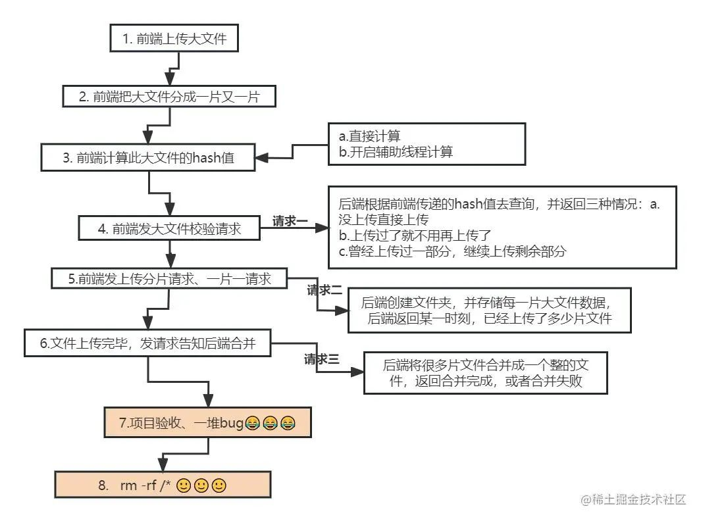
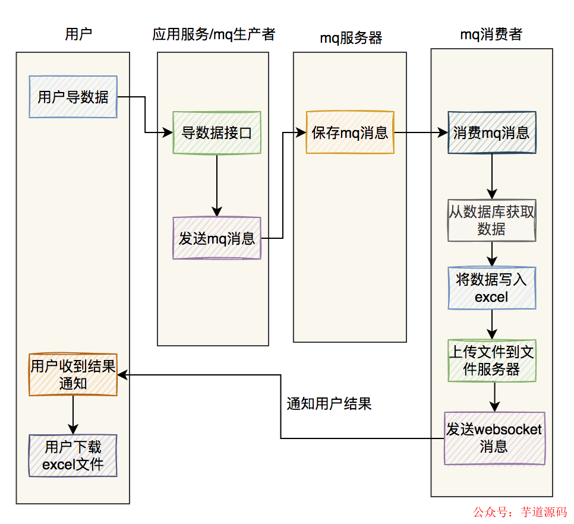
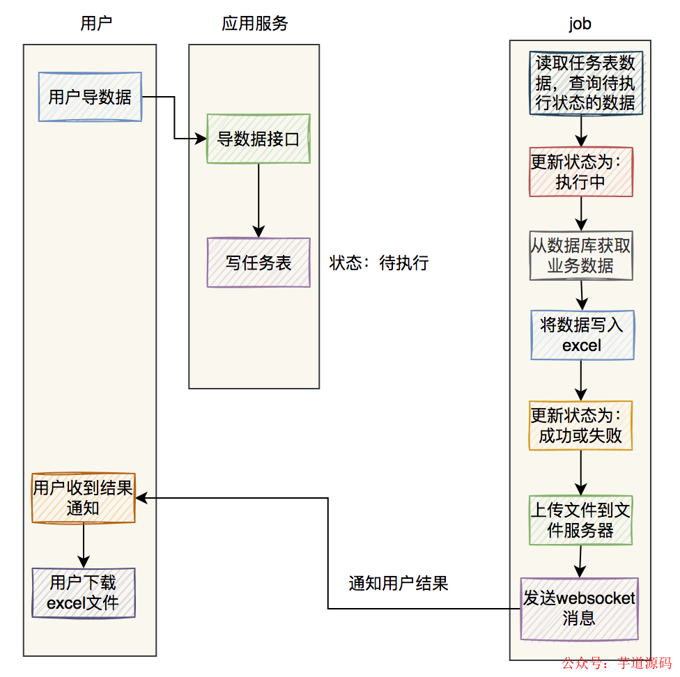

# 上传
```
https://mp.weixin.qq.com/s/BIVjITW1E50PvSyGsLMagg
```


# 导出
### 使用job实现异步处理
增加一张```执行任务表```，记录每次的导出任务。用户点击导出按钮，会调用一个后端接口，向表中写入一条记录，该记录的状态为```待执行```。启动一个定时任务，每隔一段时间（例如5分钟）执行，
当定时第一次执行到该任务时，将任务的状态变更为```执行中```，避免后续重复执行。当该任务执行完之后，该记录的状态变成```完成```或者```失败```

### 使用mq实现异步处理
① 用户点击全部导出按钮，会调用一个后端接口，该接口会向mq服务端，发送一条```mq消息```。有个专门的```mq消费者```，消费该消息，然后就可以实现excel的数据导出了  
② 对于mq消费者处理失败的情况，可以增加```补偿机制```，自动发起重试  
③ 消息始终消费失败，最终导致消息过期，则会将该消息放入```死信队列```

### 使用easyExcel
```
 @Test
public void simpleWrite() {
    String fileName = TestFileUtil.getPath() + "write" + System.currentTimeMillis() + ".xlsx";
    // 这里 需要指定写用哪个class去读，然后写到第一个sheet，名字为模板 然后文件流会自动关闭
    // 如果这里想使用03 则 传入excelType参数即可
    EasyExcel.write(fileName, DemoData.class).sheet("模板").doWrite(data());
}
```

> easyExcel能大大减少占用内存的主要原因是：在解析Excel时没有将文件数据一次性全部加载到内存中，而是从磁盘上一行行读取数据，逐个解析

### 分页查询
在mybatis中，通过limit语句实现分页功能
```
-- pageStart = (pageNo - 1) * pageSize
limit #{pageStart},#{pageSize}
```

### 多个sheet页处理
> excel对一个sheet存放的最大数据量，是有做限制的，一个sheet最多可以保存1048576行数据。否则在保存数据时会直接报错。  
> 因此如果你想导出一百万以上的数据，excel的一个sheet肯定是存放不下的

处理成多个sheet页后，要重新计算limit的起始位置
```
ExcelWriter excelWriter = EasyExcelFactory.write(out).build();
int totalPage = searchUserTotalPage(searchModel);

if(totalPage > 0) {
   Page<User> page = Page.create(searchModel);
   int sheet = (totalPage % maxSheetCount == 0) ? totalPage / maxSheetCount: (totalPage / maxSheetCount) + 1;
   for(int i=0;i<sheet;i++) {
      WriterSheet writeSheet = buildSheet(i,"sheet"+i);
      int startPageNo = i*(maxSheetCount/pageSize)+1;
      int endPageNo = (i+1)*(maxSheetCount/pageSize);
      while(page.getPageNo()>=startPageNo && page.getPageNo()<=endPageNo) {
        page = searchUser(searchModel);
        if(CollectionUtils.isEmpty(page.getList())) {
            break;
        }
        
        excelWriter.write(page.getList(),writeSheet);
        page.setPageNo(page.getPageNo()+1);
     }
   }
}
```

### 文件上传到OSS

### 通过web Socket推送通知
第一种做法是提示：```正在导出excel数据，请耐心等待```。但是这种用户交互功能，不太友好  
第二种做法是：通过```WebSocket```建立长连接，进行实时通知推送  
具体做法是，添加一张```通知表```，记录推送的通知的标题、用户、附件地址、阅读状态、通知类型等信息，当前通知的阅读状态是```未读```。用户点击该窗口，可以看到通知的详细内容，然后通知状态变成```已读```





