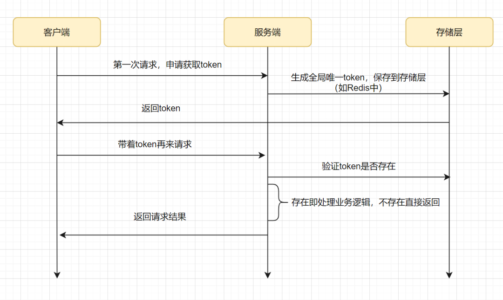

# Insert操作
① 原理：利用主键/唯一索引冲突  
先select一下数据，如果数据已经存在，就拦截是重复请求，直接返回成功，如果数据不存在，再通过主键冲突或者唯一索引冲突做最后保证，即插入数据异常，则可以直接返回成功  

② 分布式锁  
先加一个细粒度的分布式锁，然后select查一下是否存在，不存在再insert

# Update计算操作幂等方案
设置状态方案  
```
0-待处理，1-处理中、2-成功、3-失败状态
```

# 其他方案
### token令牌


### 悲观锁
利用的是行锁特征```select * from order where order_id='666' for update```

### 乐观锁
乐观锁存在ABA的问题，如果version版本一直是自增的就不会出现ABA的情况啦