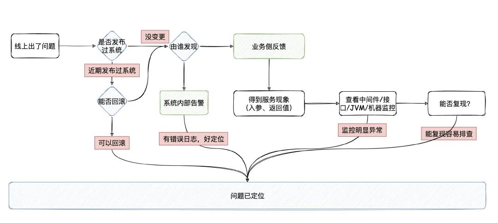

1 对核心接口做好监控告警功能，监控报警最先能发现问题  
业务代码层面的监控报警，因为监控报警是自己写的原因，所以能很快地定位出问题原因所在  
服务器资源/中间件资源的监控报警，需要花费时间排查了  
2 如果近期发布过系统，判断版本回滚是否能解决问题，并同步业务人员做相应配合（回滚很可能是最快能恢复线上正常运行的办法）  
3 恢复线上正常运行后，若不能迅速定位出来，看能不能复现，能复现都好说，肯定是能解决的  
4 如果是业务侧反馈问题，就需要明确是哪个具体的功能或者接口出现的问题，并确认操作流程和页面响应结果，然后排查日志，也应该能快速定位问题  
```
问题不能迅速定位出来，很多时候就是日志不够详细，而日志在正常情况下也不应太多
```
5 再查系统资源瓶颈，观察MySQL的CPU有没有飙高，主从同步延迟是否很大，有没有MySQL，Redis内存是否满了，搜索引擎有么有慢Query。  
再观察服务接口的QPS/RT相关的监控，看看这些指标有哪项不对  
6 如果不是中间件性能问题，再看应用和服务器本身的问题：应用GC、机器本身的网络/磁盘/内存/CPU各种指标有没有异常情况
