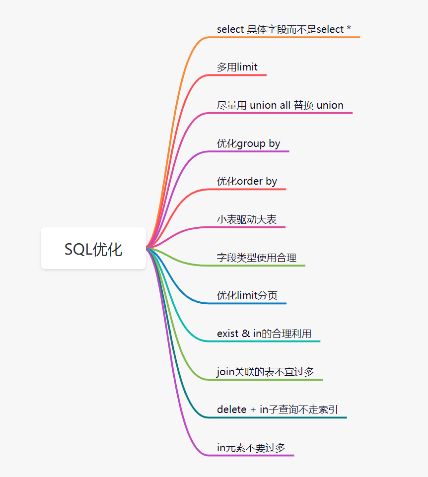

# 批量思想：批量操作数据库

# 异步思想：耗时操作，考虑放到异步执行
异步的实现方式，可以是线程池，也可以是用消息队列实现

# 空间换时间思想：恰当使用缓存
缓存包括：redis缓存、jvm本地缓存、memcached或者map等  

保证数据库和缓存一致性：缓存延时双删、删除缓存重试机制、读取binlog异步删除缓存  

缓存穿透、缓存击穿、缓存雪崩

# 预取思想：提前初始化到缓存
提前把要计算查询的数据，初始化到缓存。例如视频直播时，启动个任务，提前把直播用户、积分等相关信息，初始化到缓存

# 池化思想：预分配与循环使用
池化技术不仅仅指线程池，很多场景都有池化思想的体现，它的本质是预分配与循环使用  
学会池化思想，最直接相关的就是使用线程池而不是去new一个线程

# 事件回调思想：拒绝阻塞等待
如果你调用一个系统B的接口，但是他处理业务非常耗时，我们无需一直阻塞等待到系统B的接口返回再进行下一步  
可以参考IO多路复用模型，即我们不用阻塞等待系统B的接口返回，而是先去做别的操作，直到系统B的接口处理完，通过事件回调通知，我们接口收到通知再进行对应的业务操作即可

# 远程调用由串行改成并行
通过```completableFuture```进行异步任务编排

# 锁粒度避免过粗
本质是只需要对共享资源进行加锁即可，不涉及共享资源的，就不必要加锁

# 切换存储方式：文件中转暂存数据
如果数据量实在太大，保存数据库很慢的话，可以考虑先用文件的方式暂存，先保存好文件，再异步进行下载文件，然后将文件中数据保存到数据库  
如果你的接口耗时瓶颈就在数据库插入操作这里，批量操作之后，效果还是不理想，就可以考虑用保存文件方式或者MQ暂存等。有时候批量数据放到文件，会比插入数据库效率更高

# 索引
思考三个方面：添加索引了没？索引是否生效？索引建的是否合理？  
一般就是：SQL的where、order by、group by后面的字段需要添加索引  

索引是否设计的合理看以下几个方面：  
① 删除冗余和重复索引  
② 索引一般不能超过5个  
③ 索引不适合建立在有大量重复数据的字段上，例如性别等  
④ 适当使用覆盖索引  
⑤ 当要使用```force index```强制走某个索引，说明需要考虑索引设计是否真的合理了

# 优化SQL


# 避免大事务问题
> 所谓大事务问题就是，就是运行时间长的事务。由于事务一直不提交，就会导致数据库连接被占用，即并发场景下，数据库连接池被占满，影响到别的请求访问数据库，影响别的接口性能

> 大事务引发别的问题：接口超时、死锁、主从延迟等

规避大事务问题的方案：  
① RPC远程调用不要放到事务里面  
② 一些查询相关的操作，尽量放到事务之外  
③ 事务中避免处理太多数据

# 深度分页问题
```select id,name,balance from account where create_time> '2020-09-19' and balance > 10000 limit 100000,10;```
### 标签记录法
```select  id,name,balance FROM account where id > 100000 limit 10;```  
这种只适合连续自增的字段，每次查询的时候都是从上一次查询的最后一条开始

### 延迟关联法
```
SELECT
	acct1.id,
	acct1.NAME,
	acct1.balance 
FROM account acct1
INNER JOIN (SELECT a.id FROM account a WHERE a.create_time > '2020-09-19' LIMIT 100000, 10 ) AS acct2 
ON acct1.id = acct2.id;
```
把条件转移到主键索引树上，可以减少回表次数。  
优化思路就是，先通过idx_create_time二级索引树查询到满足条件的主键ID，再与原表通过主键ID内连接，这样后面直接走了主键索引了，同时也减少了回表

# 优化程序结构
创建了不必要的对象、或者程序逻辑混乱，多次重复查询数据库、又或者你的实现逻辑算法不是最高效的

# 压缩传输内容
如果不对视频做任何压缩编码，巨大的数据量在网络传输的耗时会比编码压缩后，慢好多倍

# 海量数据处理，考虑NoSQL
如果数据量过大，一定要用关系型数据库存储的话，就可以分库分表。但是有时候可以用es、hbase等nosql数据库

# 线程池设计是否合理
使用线程池的目的就是要让任务并行处理，更高效的完成任务，如果线程池设计不合理时，接口的执行效率则不太理想  

① 如果核心线程数过小，则达不到很好的 并行效果  
② 如果阻塞队列不合理，不仅仅是阻塞的问题，甚至可能会OOM  
③ 如果线程池不区分业务隔离，有可能核心业务被边缘业务拖垮  

# 机器问题
fullGC、线程打满、太多IO资源没关闭  
① 比如用apache poi生成excel时，当数据量很大时，如果jvm内存吃紧会直接报fullGC的  
② 如果线程打满，也会导致接口都在等待了，所以说高并发场景下，需要考虑请求限流  
③ 如果io资源没关闭，也会导致耗时增加，比如说打开很多文件而不关闭

# 接口考虑是否需要防重处理
并发度不高的时候，推荐使用数据库放重表，以唯一流水号作为主键或者唯一索引

# 调用第三方接口要考虑异常和超时处理
异常了：  
接口超时：http调用要设置超时时间，否则请求一直占用线程不释放，拖垮线程池  
重试次数：

# 接口的功能定义要具有单一性

