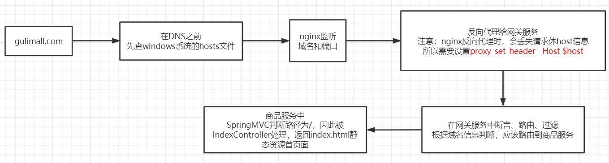
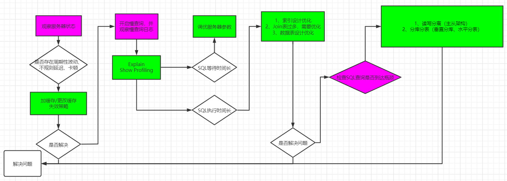

# 搭建域名访问环境
nginx代理给网关的时候，会丢失请求的host信息，甚至是cookie信息


# 接口性能
1、吞吐量  
2、响应速度  
3、错误率

# 优化方法


# 分布式锁问题
用redis实现分布式锁需要保证如下三个问题：  
1、加锁保证原子性（```SET key value [EX seconds] [PX milliseconds] [NX|XX]```）  
2、解锁保证原子性（uuid+lua脚本）  
3、锁的自动续期问题

# SpringCache的使用
1、读数据  
缓存穿透：查询一个Null数据。可以通过缓存空数据解决（cache-null-values=true）  
缓存击穿：大量并发进来同时查询一个正好过期的数据，可以通过加锁解决（@cacheable(sync=true)）  
缓存雪崩：大量的key同时过期。可以通过加随机过期时间解决。spring.cache.redis.time-to-live=3600000  
2、写数据
```
不正确处理会导致缓存与数据库中不一致问题
```
2.1、常规数据：SpringCache就可以解决  
2.2、特殊数据，特殊处理
```
读写加锁  
引入canal，感知到mysql的更新去更新数据库  
读多写多、即时性、一致性要求高的场景下，直接可以去查询数据库
```

# 异步&线程池
